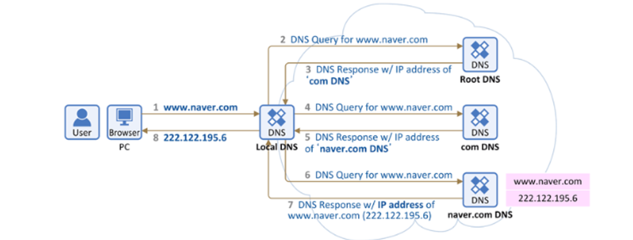

# 네트워크
## 웹 통신의 큰 흐름: https://www.google.com/ 을 접속할 때 일어나는 일

### 모범 답변

1. 브라우저 주소창에 www.google.co.kr을 입력.

2. 브라우저는 총 4개의 **cache** 에서 DNS기록 확인.

3. 요청한 URL이 cache에 없으면 **ISP**의 **DNS server** 는 재귀적으로 도메인 이름을 찾음.

4. 알맞은 IP주소를 찾으면, 브라우저는 해당 서버와 **TCP연결**을 시도.

5. TCP연결에 성공하면, 브라우저가 웹 서버에 **HTTP요청** 보냄.

6. 웹 서버는 처리한 **HTTP응답**을 브라우저에게 보냄.

7. 브라우저는 응답에 기반, HTML 컨텐츠를 **랜더링**해서 우리 눈에 보여줌.

### 전반적인 흐름

1. 사용자가 브라우저에 URL 을 입력한다.

    [www.google.com](http://www.google.com) → www(서브도메인)+ google(도메인 네임) + com(TLD) = www.google.com

2. 브라우저는 [www.google.com](http://www.google.com) 의 해당 IP 주소를 찾기 위해 DNS 캐시를 탐색
    1. 브라우저 캐시 확인
    2. OS 시스템 콜을 통해 DNS 기록 가져온다
    3. 라우터 캐시 확인
    4. 모든 단계에 실패하면 브라우저는 ISP로 이동한다. ISP는 DNS 캐시를 포함하는 자체 DNS 서버를 유지 관리한다.
3. 캐시에 없다면 로컬 DNS 서버 IP 주소로 해당 도메인 네임에 대한 질의를 요청한다(Iterative)
    - 루트 DNS 서버에서 도메인의 TLD 정보를 가지고 있는 하위 DNS 서버 IP 응답(”.com”)
    - 하위 DNS 서버에서 다음 계층의 주소를 포함하는 도메인 주소의 정보를 가지고 있는 하위 DNS 서버의 IP 응답(”.google.com”)
    - 같은 방식으로 계층 하나씩 이동하며 최종 도메인의 IP 주소를 받을 때까지 쿼리 반복
   

4. 로컬 DNS 서버로 부터 도메인 네임에 대한 IP 주소를 응답받으면 해당 내용을 DNS 캐시 테이블에 반영한다.
5. 획득한 IP 를 기반으로 브라우저가 해당 서버와 TCP 연결을 시작

    HTTP 요청의 경우 TCP 사용 → 클라이언트와 서버간의 데이터 패킷을 전송하려면 TCP 연결을 설정하는 것이 중요하다
    > i. 클라이언트는 인터넷을 통해 서버에 SYN 패킷을 전송하여 연결을 요청한다.
    > 
    > ii. 서버에 새 연결을 수락하고 시작할 수 있는 열린 포트가 있는 경우 SYN/ACK 패킷을 사용해 SYN+1 로 ACK 을 응답한다.
    >
    > iii. 클라이언트는 서버로부터 SYN/ACK 패킷을 수신하고 ACK 패킷을 전송하여 승인

5. 브라우저가 웹 서버에 HTTP 요청을 보낸다.

   GET 요청을 통해 [www.google.com](http://www.google.com) 에 대한 웹 페이지를 요구한다.

6. 서버는 요청을 처리하고 응답을 다시 보낸다.

   받아온 다양한 헤더, 쿠키 등의 정보를 읽어서 요청내용을 확인 및 처리하고 응답을 생성한다.

7. 서버는 HTTP 응답을 보낸다.

   응답에는 요청한 웹 페이지와 상태코드, 압축유형, 페이지를 캐시하는 방법, 설정할 쿠키, 개인정보 등이 포함된다.

 9.  브라우저에는 HTML 컨텐츠가 표현된다.

### 네트워크 계층별

클라이언트에서 서버로 HTTP Request를 날리는 과정은 프로토콜 레이어에 따라 아래의 과정을 거친다.

1. 응용계층: 클라이언트 애플리케이션은 HTTP Request 메시지를 생성한다.
2. 전송계층: 프로세스간의 논리적인 통신담당, 클라이언트는 서버에 TCP 연결을 설정하기 위해 3-way handshake 를 수행한다. 이 연결을 통해 데이터는 세그먼트로 분할되어 전송 되며 각 세그먼트에는 포트번호, ack 번호, 일련번호 등이 부여된다.
3. 인터넷계층: 호스트간의 통신담당, 라우팅을 통해 최적의 경로를 결정하며 IP 주소를 사용해서 이루어진다. 전송계층에서 생성된 세그먼트는 IP 헤더와 함께 IP 패킷으로 캡슐레이션 된다. IP 패킷은 출발지와 목적지 IP 주소를 가지고 있다.
4. Link 계층: 각 노드 사이 링크간 통신을 위해 사용됨, 최종 목적지 주소를 지닌 IP 주소와 달리, 다음 노드를 가리키는 MAC 주소를 이용. IP 패킷은 해당 네트워크의 링크 계층 프로토콜에 따라 프레임으로 캡슐레이션된다. 이 헤더에는 목적지 MAC 주소 등의 정보가 추가된다.
5. 물리계층: 링크 계층에서 생성된 프레임은 비트로 변환되어 목적지로 전송된다.

### 참고한 링크
https://cl8d.tistory.com/80

https://www.slideshare.net/ssuser0bcc46/ss-46924249

[https://medium.com/pocs/tcp-ip-이론-dns-캐시-테이블-6f12c4b44653](https://medium.com/pocs/tcp-ip-%EC%9D%B4%EB%A1%A0-dns-%EC%BA%90%EC%8B%9C-%ED%85%8C%EC%9D%B4%EB%B8%94-6f12c4b44653)

[https://1yoouoo.tistory.com/3#5. 서버는 요청을 처리하고 응답을 다시 보낸다.-1](https://1yoouoo.tistory.com/3#5.%20%EC%84%9C%EB%B2%84%EB%8A%94%20%EC%9A%94%EC%B2%AD%EC%9D%84%20%EC%B2%98%EB%A6%AC%ED%95%98%EA%B3%A0%20%EC%9D%91%EB%8B%B5%EC%9D%84%20%EB%8B%A4%EC%8B%9C%20%EB%B3%B4%EB%82%B8%EB%8B%A4.-1)
