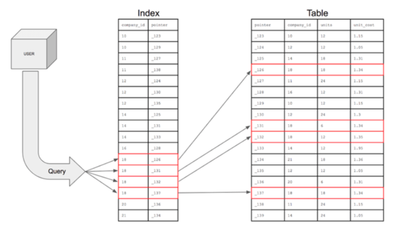
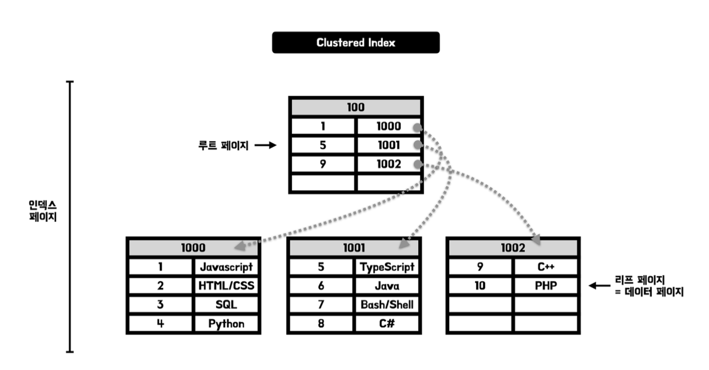
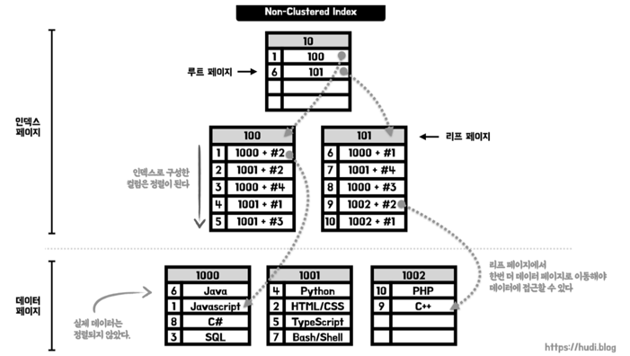

# 데이터베이스
## 데이터베이스에서 인덱스를 사용하는 이유 및 장단점에 대해 설명해주세요.
<용어정리>

**레코드 (Record):** 레코드는 데이터베이스에서 하나의 항목이나 정보 단위를 나타냅니다. 테이블에서 각 행은 하나의 레코드

**파일 (File):** 파일은 레코드의 논리적인 그룹을 나타냅니다. 데이터베이스에서 파일은 테이블이나 유사한 구조를 가리킬 때 사용

**블록 (Block):** 블록은 레코드나 데이터의 물리적인 저장 단위를 나타냅니다. 디스크나 메모리에서 데이터를 읽거나 쓸 때 사용되는 단위

**페이지 (Page):** 페이지는 일반적으로 가상 메모리 시스템에서 사용되는 용어로, 주로 블록과 유사한 개념

페이지는 주로 메모리 관리 시스템에서 사용되며, 페이지 단위로 데이터를 읽거나 쓰는 데 사용

→ 레코드를 찾는데 한 개의 페이지만으로 처리가 안된다면 다른 페이지를 읽어야하는데, 추가 페이지를 읽는 디스크 I/O작업때문에 성능이 떨어진다.

<인덱스 꼬리질문>

(1) DB 인덱스에 대해 해시 테이블을 사용해서 구현할 수도 있는데요 이런 경우 시간 복잡도가 O(1) 이고,
B+트리로 구현할 경우 검색 시간 복잡도거 O(logN) 인데 왜 B+트리를 사용하는지?

DB 인덱스 자료구조 같은 경우에는 쿼리의 조건절이 동등 연산인 경우에 해시 값으로 찾는게  O(1)로 빠르지만,
부등호 연산일 경우엔 B+트리가 항상 인덱스의 key값에 대해 정렬된 상태를 유지하니 훨씬 더 빠르고, DB 환경 자체가 동등 연산보다는 부등호 연산이 많으니 B+트리를 채택했다

(2) 해시 테이블이 어떤 자료구조인지, 좋은 해시함수의 조건이 있다면?

(3)DB 인덱스에 대해 self-balancing BST 테이블을 사용해서 구현할 수도 있는데요 왜 B+ 트리를 사용하는지?

self-balancing BST 를 사용하면 하나의 노드당 두개의 자식만 가질 수 있어 인덱스의 높이가 증가하게 되면 디스크 I/O 작업이 늘어난다. 반면 B+ 트리는 노드당 키와 데이터를 저장하는 방식이 아닌, 리프 노드에만 실제 데이터가 위치하고 내부 노드에는 키만 저장한다. 이로 인해 한 노드에 더 많은 키를 저장할 수 있으며, 높은 레벨에서 데이터에 접근하기 위한 디스크 I/O 작업을 감소시킬 수 있습니다. 또한 순차적인 접근이나 범위검색을 용이하게 하기 위해 링크드 리스트를 제공해 범위쿼리나 정렬된 결과를 쉽게 얻을 수 있다.

<인덱스>

인덱스(Index)는 데이터베이스의 테이블에 대한 검색 속도를 향상시켜주는 자료구조

테이블의 특정 컬럼에 인덱스를 생성하면, 해당 컬럼의 데이터를 정렬한 후 별도의 메모리 공간에 데이터의 물리적인 주소와 함께 저장된다.

책에서의 목차, 색인이라고 생각하자. 인덱스를 통해 원하는 내용을 빠르게 찾을 수 있다.

데이터 - 책의 내용, 인덱스 - 책의 목차, 물리적주소 - 책의 페이지 번호

<인덱스의 장점>

테이블을 검색하는 속도와 성능이 향상된다. → 기존에 Where 문으로 특정 조건의 데이터를 찾기 위해서는 테이블의 전체를 조건과 비교하는 ‘Full Table Scan’ 작업이 요구되었지만, 인덱스를 사용하면 데이터들이 정렬되어 있기 때문에 조건에 맞는 데이터를 빠르게 찾을 수 있다

조인연산을 사용하는 경우, 유니크한 값을 가져오는 경우, 검색빈도가 높은 경우

<인덱스의 단점>

인덱스를 관리하기 위해 DB의 약 10%에 해당하는 저장공간이 필요하다.

인덱스를 관리하기 위해 추가적인 작업이 필요하다.

CREATE, DELETE, UPDATE 작업 시에도 인덱스를 업데이트 해야하므로 성능저하가 발생

<인덱스의 자료구조>

Hash Table, B+Tree 등

<인덱스의 종류>

(1) 클러스터형인덱스

테이블 전체가 정렬된 인덱스가 되는 방식의 인덱스 종류

**실제 데이터와 무리(cluster)를 지어 인덱싱** 되므로 클러스터형 인덱스라고 부른다 → 영어 사전도 영어가 사전 순으로 정렬이 되어있고 영어 단어도 함께 저장되어있어서 비슷한 맥락이다.

테이블당 하나만 생성 가능하다. → PK or Unique+ Not null 인 컬럼에 대해 생성

위의 노드를 데이터베이스에서는 페이지라고 부른다.

리프 페이지는 Key로 PK를 가지고 있고, 데이터를 직접 가지고 있는 것을 확인할 수 있다.

(2) 비 클러스터형인덱스(보조인덱스)

물리적으로 테이블을 정렬하지 않는다.
정렬된 별도의 인덱스 페이지를 생성하고 관리한다. 즉, 실제 데이터를 함께 가지고 있지 않다. → 비클러스터형 인덱스는 책 뒷장의 '찾아보기' 페이지와 유사하다

인덱스 페이지와 데이터 페이지가 분리되어있다.

테이블당 여러개 생성이 가능하다.

루트페이지는 인덱스에 대한 컬럼과 페이지 번호를 가지고 있다. 반면 리프페이지는 인덱스 컬럼은 가지고 있지만 데이터 대신에 데이터 페이지 번호 + #오프셋을 가지고 있어 데이터 페이지의 특정 행을 가리킨다.

즉 데이터에 접근하기 위해서는 인덱스 페이지에서 데이터 페이지로 이동하는 과정이 추가된다.
인덱스 페이지는 정렬되어 있지만, 실제 데이터 페이지는 정렬되지 않으므로 클러스터형 인덱스에 비해 삽입, 수정, 삭제 작업이 비교적 빠르다. 데이터 페이지에는 정렬 순서 상관없이 빈 곳에 데이터를 삽입하면 되기 때문이다.

https://hudi.blog/db-clustered-and-non-clustered-index/
