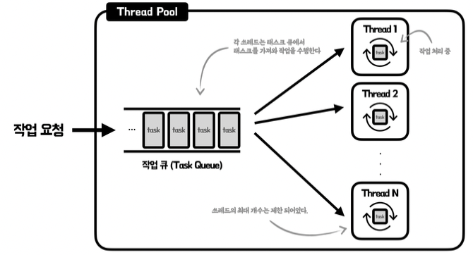

# 운영체제
## 프로세스와 쓰레드의 차이

### 모범 답변
프로세스는 운영체제로부터 자원을 할당받은 작업의 단위이고,
스레드는 프로세스가 할당받은 자원을 이용하는 실행의 단위

---
< 프로그램과 프로세스 >

프로그램은 파일이 저장장치에는 저장되어 있지만 메모리에는 올라가 있지 않은 정적인 상태이다.
프로세스는 프로그램이 실행되어 메모리에 올라간 동적인 상태를 의미한다. 즉, 실행되고 있는 프로그램이다.

< 프로세스와 스레드 >

한편, 프로세스는 메모리에 올라갈 때 운영체제로부터 시스템 자원을 할당받는다. 이 때 프로세스마다 각각의 독립된 메모리 영역(code,data,stack,heap) 의
형식으로 할당해준다.

스레드의 경우 메모리 공유가 가능한데, 프로세스가 할당받은 메모리 영역 내에서 스택 형식으로 할당된 메모리 영역을 따로 할당받고 나머지 code,data,heap 형식으로 할당된 메모리 영역만 공유한다.

---
< 멀티 프로그래밍, 멀티 태스킹, 멀티 쓰레딩, 멀티 프로세싱, 멀티 프로세스 >
* 멀티 프로그래밍

    * 단일 프로세스가 CPU 사용량이 좋지 않다는 점에 착안해 등장
    
    * 여러 개의 프로그램을 메모리에 올려 놓고 동시에 실행 시키는 원리, I/O 작업이 발생하면 다른 프로세스가 CPU에서 실행된다.
    
    * CPU 사용량을 극대화 시킴
    
    * CPU 사용 시간이 길어지면 다른 프로세스는 계속 대기 해야 한다.

*  멀티 태스킹 -> 시분할 시스템
   * 여러 개의 프로그램이 동시에 실행 되는 것처럼 보이게 하는 기법 (cpu 타임을 아주 잘게 쪼갠다) -> 하나의 프로세스가 동시에 여러 작업을 수행하지는 못한다.

   * 프로세스의 응답시간을 최소화 시키는 목적

    * 스레드의 등장으로 프로세스끼리의 아주 짧은 시간의 스위칭에서 프로세스와 스레드가 아주 짧게 쪼개진 cpu 타임을 나누어 가지는 것으로 개념 확장됨
* 멀티 쓰레딩
    * 프로세스의 컨텍스트 스위칭은 오버헤드가 크다.
    * 프로세스끼리의 데이터 공유가 까다롭다.
    * 듀얼 코어가 등장 해서 CPU 의 성능이 병렬 작업이 유리해졌다.

* 멀티 프로세스
  * 여러 개의 프로세스가 서로 협력적으로 일을 처리하는 것
* 멀티 프로세싱
  * 두 개 이상의 프로세서나 코어를 활용하는 시스템

---
< 멀티 쓰레드의 장단점 >
* 장점
1. 컨텍스트 스위칭 시 공유하고 있는 메모리 자원을 아낄 수 있다.
2. 스레드는 프로세스 내의 스택 영역을 제외한 부분을 공유하기 때문에 통신의 오버헤드가 적어 응답시간이 빠르다.

* 단점
1. 스레드 하나가 프로세스 내 자원을 망치면 모든 프로세스가 종료된다.
2. 자원을 공유하기 때문에 동기화 문제가 발생할 수 밖에 없다.

    운영체제가 멀티 스레드의 스케줄링을 담당하지 않기 때문에 프로그래머가 동기화 문제에 신경 써야한다.

< 멀티 프로세스의 장단점 >
* 장점
1. 각각의 독립적인 메모리 공간을 가지기에 자원 관리를 더 쉽게 할 수 있다.
2. 멀티 스레드에 비해 시스템이 안정적이다

* 단점
1. 멀티 스레드보다 더 많은 공간을 사용한다.
2. 프로세스간 컨텍스트 스위칭의 오버헤드가 크다.

---
[ 쓰레드 풀] - 쓰레드 컨텍스트 스위칭 오버 헤드 방지 하기 위한 기법

< 풀 >

풀: 자원을 사용하는 시점에 메모리에 올리고, 사용을 완료한 이후 메모리에서 해제하는 대신 이미 사용할 준비가 된 자원을 메모리 위에 일정량 미리 생성해둔 자원의 집합, 
자원이 필요할 경우 새로 자원을 생성하는 대신 풀에서 꺼내 사용하고, 사용이 완료된 경우 자원을 해제하는 대신 풀에 다시 반환하는 형태로 사용한다.

< 쓰레드 풀 사용하는 이유 >
* 쓰레드를 생성하고, 파괴하는 오버헤드가 발생하기 때문이다. 

* 너무 많은 쓰레드가 제한된 하드웨어 리소스를 공유하게 되는 문제도 발생한다. -> 쓰레드 폭증으로 인한 애플리케이션 성능 저하

쓰레드를 제한된 개수로 생성한 뒤, 들어오는 작업을 작업 큐(task queue)에 채워 넣은뒤 쓰레드 별로 할당하여 작업을 처리한다.

톰캣과 같은 WAS 는 다수의 요청에 대해 동시에 작업을 진행해야하기 때문에 멀티 쓰레드 환경에서 동작하며, 클라이언트의 요청을 쓰레드에 할당해 병렬 처리한다. -> 톰캣에서도 내부적으로 쓰레드 풀을
관리하는 것을 알 수 있다. 쓰레드 풀은 웹 애플리케이션 서버와 같이 병렬 처리가 잦은 프로그램에서 사용하기 적합하다.

https://hudi.blog/java-thread-pool/
