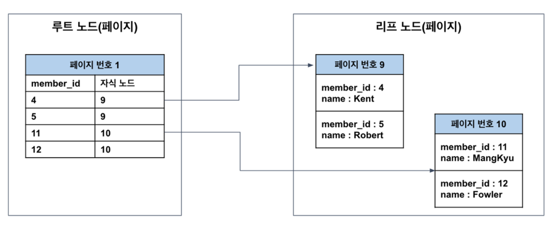
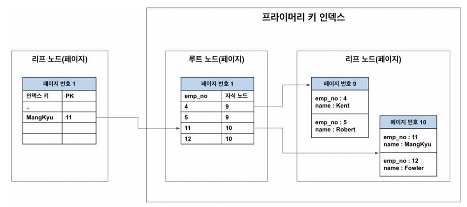
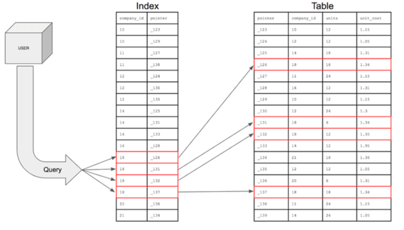
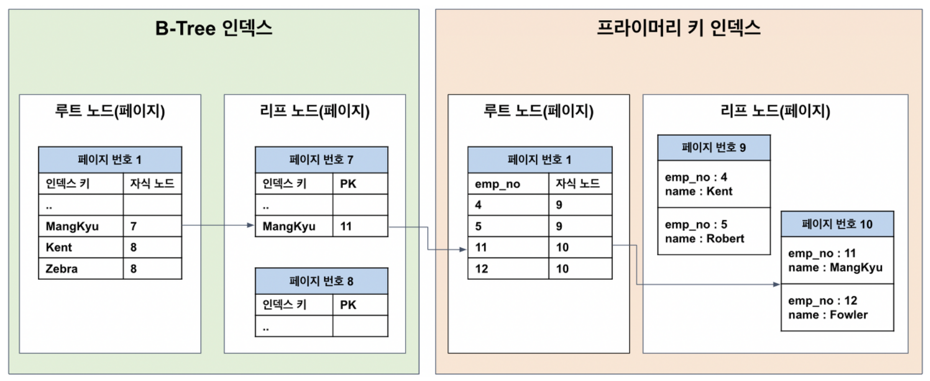

# 인덱스 정리

## PK
* MYSQL에서 PK는 레코드의 저장위치를 결정한다. 따라서 PK는 NOT NULL, 유니크 등의 성질을 지닌다.
* MYSQL 에서는 PK를 기준으로 유사한 값들이 함께 조회된 경우가 많다는 점에 착안해 PK 가 유사한 레코드들끼리 묶어서 저장한다.(클러스터링) 
  * PK는 클러스터 인덱스라고 불린다
  * 클러스터링 특성 때문에 레코드 저장이나 PK 변경은 처리 속도가 느리다.
    * 레코드를 추가하기 위해 PK를 기반으로 레코드의 저장위치를 파악해야한다.
    * PK를 변경하는 것은 레코드가 저장된 물리적인 위치를 변경하는 작업이 수반되기 때문이다.
* 일반적인 데이터베이스에서 쓰기: 읽기의 비율이 2:8 정도 이기 때문에 이러한 희생을 감수하고 PK를 사용한다.


### PK 와 테이블 저장방식, 클러스터링 테이블의 저장방식
* 클러스터링 테이블 
  * 클러스터 인덱스를 갖는 테이블
  * MYSQL 에서는 PK 가 기본적으로 클러스터 인덱스이고, PK 가 없으면 내부적으로 PK를 만들어낸다. - 모든 테이블이 클러스터링 테이블이다.
  * 구조 (PK는 클러스터 인덱스이기에 인덱스와 마찬가지로 별도의 자료구조에서 관리된다, 리프노드에 실제 레코드의 모든 컬럼이 저장되어 있다는 점을 제외하면 일반적인 인덱스와 동일)
    
    > 위 그림에서 루트 노드가 비 클러스터 인덱스이다. 리프노드에 데이터가 아닌 PK를 가지고 있기 때문
  
### PK와 인덱스의 관계
* PK가 레코드들의 물리적인 위치를 결정하기 때문에 인덱스는 PK 에 의존적이다.
* 따라서 인덱스를 타고 들어와서 PK를 통해 저장된 위치에서 레코드를 읽어온다. -> 이 점 때문에 인덱스를 통해 테이블에서 데이터를 가져오려면 2번의 작업이 필요하다.
  1. 인덱스에서 인덱스 키를 통해 PK 를 찾는다.
  2. PK를 통해서 테이블로부터 데이터를 읽어와야한다.
  > 결론: 인덱스를 통해 데이터를 읽어오는 것 보다는 PK로 읽어오는게 빠르다고 볼 수 있다.

### 클러스터 인덱스의 장점, 단점
* 장점
  * PK로 검색할 경우 처리가 매우 빠름
  * 연속되는 PK를 조회할 경우 랜덤 I/O 가 아닌, 순차 I/O 를 사용해 처리 속도 매우 빠름
  * 인덱스가 PK를 가지므로 인덱스로 PK만 조회하는 경우 효율적으로 처리 가능 - 커버링 인덱스
  > 커버링 인덱스: 쿼리 전체가 인덱스 컬럼값으로 다 채워진 경우

* 단점
  * 모든 인덱스가 PK에 의존하므로, PK의 크기가 클수록 전체적인 인덱스의 크기가 커지고 페이지의 양이 많아짐
  * 인덱스를 통해 검색 시 PK로 다시한번 검색해야하므로 처리 성능이 느림
  * INSERT 시 PK 에 의해 레코드의 저장 위치가 결정되기에 처리 성능이 느림
  * PK 변경 시 레코드를 DELETE 및 insert 해야하므로 처리 성능이 느리다.

* 구조
  
## 페이지
디스크와 버퍼풀(메모리) 에 데이터를 읽고 쓰는 최소 작업 단위이다.
일반적인 인덱스를 포함해 PK와 테이블은 모두 페이지 단위로 관리된다.
쿼리를 통해 1개의 데이터(레코드) 를 읽고 싶어도 하나의 블록 즉 페이지 단위로 읽어야한다.
따라서, 페이지에 저장되는 개별 데이터들의 크기를 최대한 작게하 최대한 하나의 블록으로 여러개의 데이터를 조회할 수 있도록 해야한다.

* 페이지에 저장되는 개별 데이터의 크기(```인덱스의 크기라 생각해도 된다```) 가 클수록
  * 1개의 페이지만으로 조회해야하는 데이터 수를 처리할 수 없으면 추가적인 페이지를 읽어야한다.(페이지의 크기는 제한적이므로) -> 추가적인 I/O 작업 수반, 읽어야하는 페이지 수만큼 성능이 하락한다.
  * 개별 데이터의 크기가 커지면 하나의 페이지의 크기가 커지고, 메모리에 캐싱할 수 있는 페이지 수가 줄어든다.(메모리 크기가 제한적이기 때문)
  

## 인덱스
* 추가적인 쓰기 작업과 저장 공간을 활용해 데이터베이스 테이블의 검색 속도를 향상시키기 위한 구조
* 책의 색인과 비슷
* 테이블의 모든 데이터를 검색하려면 시간이 오래걸리기 때문에 특정 컬럼과, 해당 데이터의 위치를 포함한 자료구조를 생성해 빠르게 조회하도록 한다.
* 구조 - 인덱스를 기준으로 정렬하고 포인터가 해당 데이터의 컬럼의 정보를 지닌다.
   

### 인덱스 관리
* INSERT, UPDATE, DELETE
  * INSERT: 새로운 데이터에 대한 인덱스를 추가하고 인덱스 테이블을 재정렬해야한다.
  * UPDATE: 기존의 인덱스를 사용하지 않음을 처리하고, 갱신된 데이터에 대한 인덱스를 추가하고, 재정렬해야한다.
  * DELTE: 삭제하는 데이터의 인덱스를 사용하지 않는다는 작업을 진행, 재정렬 필

### 인덱스 장단점
* 장점
  * 테이블을 조회하는 속도와 성능 향상
* 단점
  * 인덱스를 관리하기 위해 DB의 10% 정도의 별도의 저장공간이 필요하다.
  * 인덱스 관리위한 추가작업이 필요하다.
  * 인덱스를 잘못 사용할 경우 오히려 성능저하가 발생할 수 있음

### 인덱스 사용하면 좋은 경우
* 규모가 작지 않은 테이블
* INSERT, UPDATE, DELETE가 자주 발생하지 않는 컬럼
* JOIN이나 WHERE 또는 ORDER BY에 자주 사용되는 컬럼
* 데이터의 중복도가 낮은 컬럼

### 인덱스 자료구조
1. 해시테이블
   * (Key,Value) 를 저장하는 자료구조로 빠른 데이터 검색 시 유용하다.
   * Key 값을 이용해 고유한 index 를 생성해 그 index 에 해당하는 자료구조를 꺼내오는 방식
   * 등호 연산에만 유리
2. B+Tree
   * 리프노드(데이터노드)만 인덱스와 함께 데이터(Value)를 가지고 있고, 나머지 노드(인덱스노드)들은 데이터를 위한 인덱스(Key)만을 갖는다.
   * 리프노드들은 LinkedList로 연결되어 있다.
   * O(logn)의 시간복잡도를 가지며 인덱싱에 유리

### B+Tree 인덱스
* 인덱스는 페이지 단위로 저장되며 인덱스 키를 기준으로 항상 정렬된 상태 유지
* 리프 노드 도달 시 (인덱스키, PK) 쌍으로 저장되어있다.
* 구조
  
* 연속된 데이터를 조회하는 경우에는 순차 I/O가 발생

> ```인덱스를 통해 데이터를 조회한다```의 의미
> 1. 인덱스를 통해 PK를 찾는다.
> 2. PK를 통해 레코드를 찾는다.
> 루트노드에서 브랜치 노드를 거쳐 리프 노드로 이동한다. 그 후 해당 페이지의 처음부터 시작해 시작점을 찾는데 이를 탐색이라한다.
> 시작점을 찾았으면 마지막 인덱스까지 읽으면 되는데 이를 스캔이라한다.
> > 인덱스에 PK가 저장되는 것은 MySQL의 InnoDB가 클러스터 테이블이기 때문에 이러한 구조를 갖는 것!! 다른 DBMS 는 다를 수 있음

위의 두 작업이 순차적으로 실행되기에 인덱스로 레코드 한건을 읽는 것이 테이블을 통해 읽는 것보다 비용이 더 들어간다.
하지만 DBMS는 우리가 원하는 레코드가 어디있는지 모르므로, 모든 테이블을 뒤져서 레코드를 찾아야한다. 
이는 엄청난 디스크 읽기 작업이 필요하므로 상당히 느리다.

하지만, 인덱스를 사용한다면 인덱스를 통해 PK를 찾고 PK를 통해 레코드를 저장된 위치에서 바로 가져와 디스크 읽기가 줄어든다. -> 레코드를 찾는 속도가 빠르다.

한편, 인덱스를 통해 레코드를 읽는 것이 테이블을 통해 레코드를 읽는 작업에 비해 4-5배가 비싸기 때문에, 읽어야할 레코드의 건수가 전체 테이블의 20-25% 이상이면 인덱스를 이용하지
않는 것이 효과적이다. 이런 경우 풀스캔이 유리하다.

### 인덱스 사용에 영향을 주는 요소
1. PK 크기(클수록 -)
2. 카디날리티(클수록 고유값 많은 것이고, +)
3. 인덱스 컬럼 순서
   * 다중 컬럼 인덱스의 경우 다음 컬럼은 이전 컬럼 의존하여 정렬된다.
4. 인덱스 정렬 및 스캔 방향

### 결론
인덱스는 저장(INSERT, UPDATE, DELETE)의 성능을 희생하고 

데이터의 읽기 속도를 높이는 기능이다. 

인덱스가 필요한 이유는 쓰기 작업이 조금 느리더라도, 읽기 작업을 빠르게 유지하도록 하기 위함이다. 왜냐하면 일반적인 온라인 환경에서 읽기와 쓰기의 비율이 8:2, 9:1이기 때문이다.

### 참고
InnoDB는 테이블 락이 아닌 레코드 단위의 락을 기본으로 한다.
이 때 레코드락은 레코드가 아닌 인덱스 레코드에 락을 건다.


---
https://mangkyu.tistory.com/286
https://jojoldu.tistory.com/476
