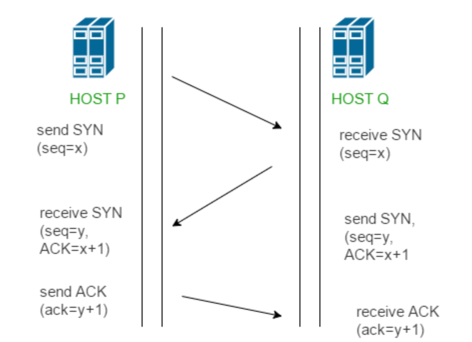
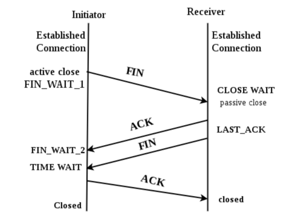

# TCP 3, 4 way handshake에 대해서 설명해보세요.

< 답변의 키 포인트> 

TCP 프로토콜에서 연결을 성립하고 해제하는 과정을 말한다. 
TCP 는 정확한 전송을 보장해야하기 때문에 통신하기에 앞서, 논리적인 접속을 성립하기 위해 3 way handshake 과정을 진행한다.
---
[ 3 way handshake ]

1. 클라이언트가 서버에게 SYN 패킷을 보냄 (sequence : x)

2. 서버가 SYN(x)을 받고, 클라이언트로 받았다는 신호인 ACK와 SYN 패킷을 보냄 (sequence : y, ACK : x + 1)

3. 클라이언트는 서버의 응답은 ACK(x+1)와 SYN(y) 패킷을 받고, ACK(y+1)를 서버로 보냄

이렇게 3번의 통신이 완료되면 연결이 성립한다.

[ 4 way handshake ]

연결 성립 후 모든 통신이 끝났다면 연결을 해제해야한다.

1. 클라이언트는 서버에게 연결을 종료한다는 FIN 플래그를 보낸다.
2. 서버는 FIN을 받고, 확인했다는 ACK 을 클라이언트에게 보낸다. -> 해당 연결에 대한 데이터 처리를 완료하기 위해 CLOSE_WAIT 상태가 된다.
3. 데이터를 모두 보냈다면, 연결이 종료되었다는 FIN 플래그를 클라이언트에게 보낸다.
4. 클라이언트는 FIN 을 받고, 확인했다는 ACK 을 서버에게 보낸다. -> 아직 서버로부터 받지 못한 데이터가 있을 수 있으므로 TIME_WAIT 를 통해 기다린다.
    * 서버는 ACK 을 받은 이후 소켓을 닫는다. (Closed)
    * TIME_WAIT 시간이 끝나면 클라이언트도 닫는다. (Closed)

