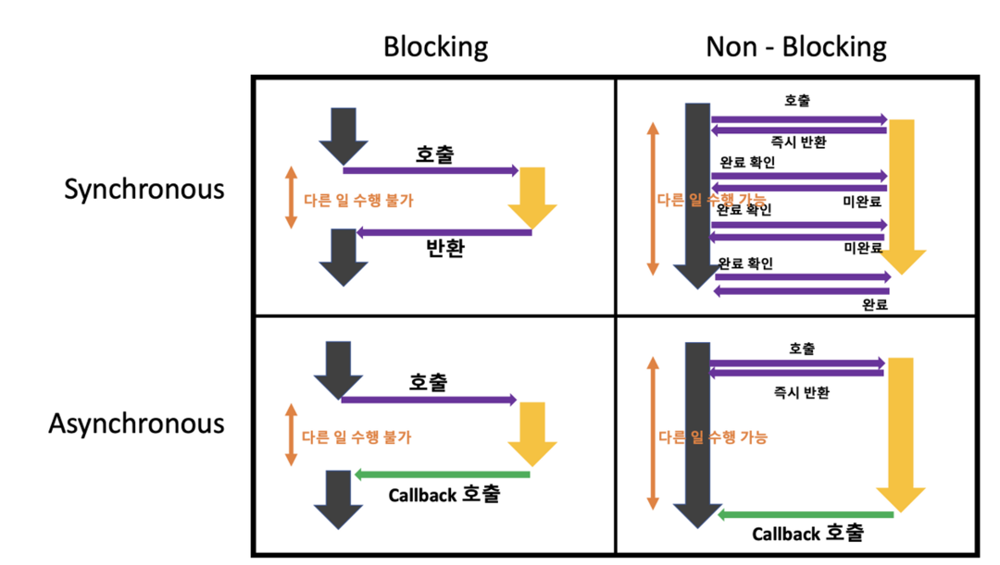

# 동기와 비동기의 차이(블로킹, 넌블로킹) / 장단점에 대해 설명해보세요.

<답변의 키포인트>

동기/비동기는 작업을 순차적으로 실행할 것인지 아닌지에 대한 관점이고,
블로킹/넌블로킹은 현재 작업이 차단 되느냐/안되느냐에 따라 다른 작업을 수행할 수 있는지에 대한 관점이다.

---

<동기와 비동기>

Synchronous: Syn은 그리스어로 '함께'이란 뜻이고 chrono는 '시간'이라는 뜻 -> 작업시간을 함께 맞춰서 실행한다.= 요청한 작업에 대해 완료 여부를 따져 순서대로 처리한다.
Asynchronous: 요청한 작업에 대해 완료여부를 따지지 않는다.

두 개념은 성능상에 큰 차이를 불러일으킨다. 비동기는 요청한 작업에 대해 완료여부를 따지지 않고 자신의 그 다음 작업을 수행한다는 것인데 이는 I/O 작업과 같이 느린 작업이
발생시 기다리지 않고 다른 작업을 처리할 수 있기 때문이다. 이는 멀티 쓰레드나 멀티 프로세스 방식에 활용될 수 있다.

<블로킹과 논블로킹>

다른 요청의 작업을 처리하기 위해 현재 작업을 차단하냐 안하냐의 유무를 나타내는 프로세스의 실행 방식

* 동기+블로킹: 다른 작업이 진행되는 동안 자신의 작업을 처리하지 않고, 다른 작업의 완료 여부를 받아 순차적으로 처리하는  - 예) 커맨드라인 입력

* 동기+논블로킹: 다른 작업이 진행되는 동안에도 자신의 작업 처리하고, 다른 작업의 결과 바로 처리하여 순차적으로 처리하는  - 예) 웹 브라우저 파일 다운로드 로딩바

* 비동기+논블로킹: 다른 작업이 진행되고 있는 동안에도 자신의 작업을 처리하고, 작업의 순서가 보장되지 않는 것 - ex) 작업량이 많거나 시간이 오래걸리는 작업의 경 - 예) 웹 브라우저 파일 다운로드

