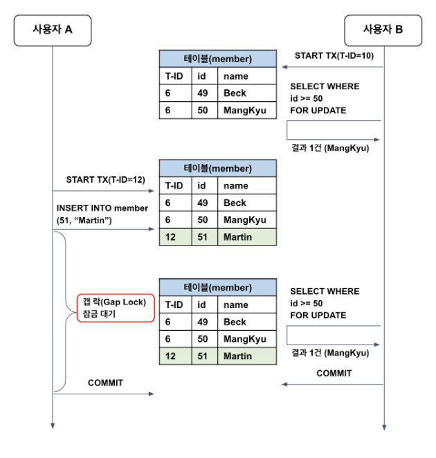

# 트랜잭션 격리 수준(Transaction Isolation Levels)에 대해서 설명해주세요.
트랜잭션의 특징을 모두 지키려면 동시성이 매우 떨어진다. 이때 트랜젝션의 격리 수준을 활용해 ACID 원칙을 적절히 희생해 동시성을 얻는다.
Serializable, Repeatable read, Read commited, Read uncommited 가 있으며 Serializable 로 갈수록 동시성이 떨어지지만 정합성이 높아진다.

---
### Commit 과 Rollback
* Commit: 하나의 트랜젝션이 성공적으로 끝났고, DB가 일관성있는 상태일 때 이를 알려주기 위해 사용하는 연산
* Rollback: 하나의 트랜젝션 처리가 비정상적으로 종료되어 트랜젝션의 원자성이 깨진 경우

-> ACID 원칙을 strict 하게 지키려면 동시성이 매우 떨어진다. 그렇기 때문에 Transaction 의 Isolation level 을 통해 ACID 원칙을 희생해 동시성을 얻는다.

---
### Isolation Level 트랜젝션 격리수준 

복수개의 트랜잭션이 한번에 처리될 때, 특정 트랜잭션이 변경하거나 조회하고 있는 데이터에 대해서 다른 트랜잭션에 대해 조회 허용 여부를 결정하는 것이다.

트랜잭션 격리 수준은 아래와 같이 4개로 구분된다. 밑으로 갈수록 격리 수준이 낮아지며, 동시 처리 성능이 높아진다. 반면 데이터 부정합 문제가 발생할 확률이 높다.
-> 데이터 정합성과 성능은 반비례한다.


(1) READ UNCOMITTED (커밋되지 않은 읽기)
  * 어떤 트랜잭션에서 처리한 작업이 완료되지 않았음에도 다른 트랜잭션에서 볼 수 있게 되는 현상인 더티리드가 발생한다. 데이터가 조회되었다가 사라지므로 시스템에 상당한 혼란을 준다. ->
    이 격리수준에서 롤백을 사용한다면 데이터 조회시 결과가 달라지는 심각한 문제가 생긴다.

  * 데이터 부정합 문제가 발생할 확률이 높지만, 성능은 가장 빠르다.

더티리드와 반복 불가능한 조회 문제, 팬텀리드 문제가 발생한다.

(2) READ COMMITTED (커밋된 읽기) - 오라클 기본 격리 수준, 온라인 서비스에서 가장 많이 사용됨
  * 어떤 트랜잭션에서 변경한 내용이 커밋되기 전까지는 다른 트랜잭션에서 변경 내역을 조회가 불가능하다-> 커밋되기 전 데이터는 Undo 영역에서 가져오기 때문
  * 커밋이 완료된 트랜잭션의 변경사항만 다른 트랜잭션에서 조회할 수 있도록 허용하는 격리 수준이다.
    즉, 특정 트랜잭션이 이루어지는 동안 다른 트랜잭션은 해당 데이터에 접근할 수 없다.

  커밋되기 전의 데이터를 읽을 경우 Undo 영역에서 데이터를 읽어온다.

  팬텀 리드와 반복 불가능한 조회 문제가 발생한다.


> 하나의 트랜잭션 내에서 항상 같은 결과를 보장해야하는 REPEATABLE READ 정합성에 어긋남 -> 하나의 트랜잭션에서 동일한
> 데이터를 여러번 읽고 변경하는 작업이 금전적인 처리와 연결되면 문제가 생김


(3) REPEATABLE READ (반복 가능한 읽기) - MySQL InnoDB 스토리지 엔진 기본 격리 수준
  * Read-Commited 와 마찬가지로 언두 영역에 백업된 이전 데이터를 통해 트랜잭션 내에서는 동일한 결과를 보장하도록 하여 더티리드 문제를 해결한다.
  * 하지만 다른 점은, 이 격리 수준은 언두 영역에 백업된 레코드의 여러 버전 가운데 몇 번째 버전을 보여주냐에 차이가 있어서 SELECT 시 반복 불가능한 문제를 해결할 수 있다.
  * 실행 중인 트랜잭션보다 작은 트랜잭션에서 변경한 데이터만 보게하여 반복 불가능한 조회 문제를 해결한다.

(*) 아래는 추가 공부가 필요
> SELECT ... FOR UPDATE, SELECT ... FOR SHARE 쿼리의 경우 언두 영역이 아닌 테이블의 레코드를 가져오게 되어서 팬텀리드 현상이 발생한다.
>
> 일반적으로 MySQL 의 REPEATABLE READ 격리수준에서는 해당 레코드에 대해서는 레코드락, 그 값보다 큰 범위에는 갭락으로 넥스트 키 락을 건다. 따라서 사용자가 insert 를 시도한다면,
> 다른 트랜잭션이 종료될 때까지 기다리다가 대기를 너무 오래하면 락 타임아웃이 발생한다.
>
>아래와 같이 팬텀리드가 발생하지 않게 된다.


> MySQL 기준 REPEATABLE READ 에서의 팬텀리드는 아래와 같이 이해하자.
> * SELECT FOR UPDATE 이후 SELECT: 갭락 때문에 팬텀리드 X
> * SELECT FOR UPDATE 이후 SELECT FOR UPDATE: 갭락 때문에 팬텀리드 X
> * SELECT 이후 SELECT: MVCC 때문에 팬텀리드 X
> * SELECT 이후 SELECT FOR UPDATE: 팬텀 리드 O

(4) SERIALIZABLE (직렬화 가능)

  특정 트랜잭션이 사용중인 테이블의 모든 행을 다른 트랜잭션이 접근할 수 없도록 잠근다. 가장 높은 데이터 정합성을 갖으나, 성능은 가장 떨어진다.


### 데이터 부정합 문제 

* 더티 리드 (Dirty Read)
  * 데이터가 나타났다가 사라졌다 하는 현상 초래
  * 더티 리드는 특정 트랜잭션에 이해 데이터가 변경되었지만, 아직 커밋되지 않은 상황에서 다른 트랜잭션이 해당 변경 사항을 조회할 수 있는 문제를 말한다.
* 반복 불가능한 조회 (Non-Repeatable Read)

  같은 트랜잭션 내에서 같은 데이터를 여러번 조회했을 때 읽어온 데이터가 다른 경우를 의미한다.
* 팬텀 리드 (Phantom Read)

  ```SELECT ... FOR UPDATE``` 쿼리와 같은 쓰기 잠금을 거는 경우 다른 트랜잭션에서 수행한 변경 작업에 의해 레코드가 보였다가 안 보였다가 하는 현상을 말한다.
    >  SELECT ... FOR UPDATE 쿼리의 경우 SELECT하는 레코드에 쓰기 잠금을 걸어야 하는데, 언두 영역에는 잠금을 걸 수 없기 때문이다. 
    > 따라서 어쩔 수 없이 SELECT ... FOR UPDATE 나 SELECT ... LOCK IN SHARE MODE 로 조회되는 레코드는 언두 영역의 변경 전 데이터를 가져오는 것이 아니라 현재 레코드의 값을 가져온다.

 
---
### 동시성 제어

https://mangkyu.tistory.com/96
https://mangkyu.tistory.com/286
https://mangkyu.tistory.com/298
https://mangkyu.tistory.com/285

---

#### 참고한 글
https://mangkyu.tistory.com/299
