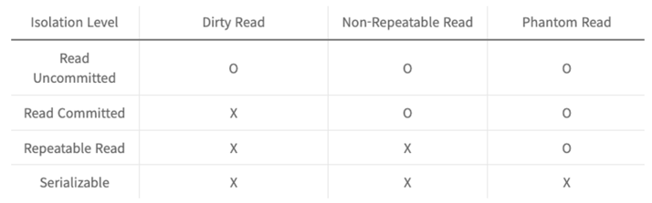
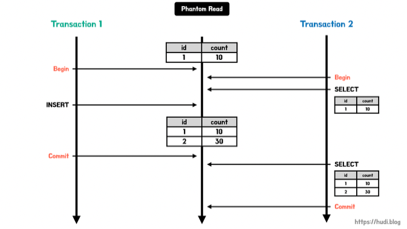
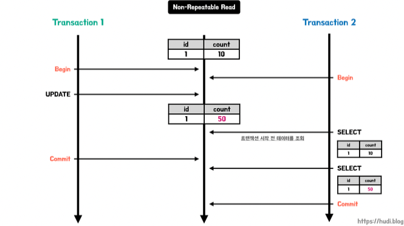

# 트랜잭션 격리 수준(Transaction Isolation Levels)에 대해서 설명해주세요.
트랜잭션의 특징을 모두 지키려면 동시성이 매우 떨어진다. 이때 트랜젝션의 격리 수준을 활용해 ACID 원칙을 적절히 희생해 동시성을 얻는다.
Serializable, Repeatable read, Read commited, Read uncommited 가 있으며 Serializable 로 갈수록 동시성이 떨어지지만 정합성이 높아진다.

---
[Commit 과 Rollback]
* Commit: 하나의 트랜젝션이 성공적으로 끝났고, DB가 일관성있는 상태일 때 이를 알려주기 위해 사용하는 연산
* Rollback: 하나의 트랜젝션 처리가 비정상적으로 종료되어 트랜젝션의 원자성이 깨진 경우

-> ACID 원칙을 strict 하게 지키려면 동시성이 매우 떨어진다. 그렇기 때문에 Transaction 의 Isolation level 을 통해 ACID 원칙을 희생해 동시성을 얻는다.

---
< Isolation Level 트랜젝션 격리수준 >

복수개의 트랜잭션이 한번에 처리될 때, 특정 트랜잭션이 변경하거나 조회하고 있는 데이터에 대해서 다른 트랜잭션에 대해 조회 허용 여부를 결정하는 것이다.

트랜잭션 격리 수준은 아래와 같이 4개로 구분된다. 밑으로 갈수록 격리 수준이 낮아지며, 동시 처리 성능이 높아진다. 반면 데이터 부정합 문제가 발생할 확률이 높다.
-> 데이터 정합성과 성능은 반비례한다.

* SERIALIZABLE (직렬화 가능)

  특정 트랜잭션이 사용중인 테이블의 모든 행을 다른 트랜잭션이 접근할 수 없도록 잠근다. 가장 높은 데이터 정합성을 갖으나, 성능은 가장 떨어진다.
* REPEATABLE READ (반복 가능한 읽기)

  특정 행을 조회시 항상 같은 데이터를 응답하는 것을 보장하는 격리 수준이다. 하지만, SERIALIZABLE과 다르게 행이 추가되는 것을 막지는 않는다. 이로 인해 팬텀 리드 현상이 발생할 수 있다.

* READ COMMITTED (커밋된 읽기)

  커밋이 완료된 트랜잭션의 변경사항만 다른 트랜잭션에서 조회할 수 있도록 허용하는 격리 수준이다. 즉, 특정 트랜잭션이 이루어지는 동안 다른 트랜잭션은 해당 데이터에 접근할 수 없다.

  커밋되기 전의 데이터를 읽을 경우 Undo 영역에서 데이터를 읽어온다.

  팬텀 리드와 반복 불가능한 조회 문제가 발생한다.

* READ UNCOMITTED (커밋되지 않은 읽기)

  커밋이 되지 않은 트랜잭션의 데이터 변경 내용을 다른 트랜잭션이 조회하는 것을 허용하는 격리 수준이다. 데이터 부정합 문제가 발생할 확률이 높지만, 성능은 가장 빠르다.
  어떤 트랜젝션의 작업이 완료되지도 않았는데 다른 트랜젝션에서 볼 수 있는 부정합 문제를 더티리드라고 한다. 데이터가 조회되었다가 사라지므로 시스템에 상당한 혼란을 준다.
  이 격리수준에서 롤백을 사용한다면 데이터 조회시 결과가 달라지는 심각한 문제가 생긴다. 

  따라서 MySQL 을 사용시 READ COMMITED 격리 수준 이상 사용하는 것이 좋다.

< 데이터 부정합 문제 >

* 더티 리드 (Dirty Read)

  더티 리드는 특정 트랜잭션에 이해 데이터가 변경되었지만, 아직 커밋되지 않은 상황에서 다른 트랜잭션이 해당 변경 사항을 조회할 수 있는 문제를 말한다.
* 반복 불가능한 조회 (Non-Repeatable Read)

  같은 트랜잭션 내에서 같은 데이터를 여러번 조회했을 때 읽어온 데이터가 다른 경우를 의미한다.
* 팬텀 리드 (Phantom Read)

  Non-Repeatable Read의 한 종류로 조회해온 결과의 행이 새로 생기거나 없어지는 현상이다.

---
< 동시성 제어 >

추후작성

---

#### 참고한 글
https://mangkyu.tistory.com/299
