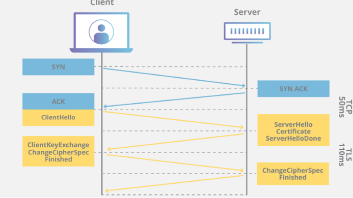

# HTTPS에 대해서 설명하고 SSL Handshake에 대해서 설명해보세요.

전반적인 과정에 대해 설명해주세요

SSL Handshake는 암호화 형성 과정에서 진행되는 프로토콜로 대칭키와 비대칭키 알고리즘이 사용됩니다.
우선 사용자가 서버에 요청을 보내면 서버는 자신의 공개키를 CA의 인증서와 함께 보냅니다. 사용자는 인증서를 통해 공개키의 신뢰성을 확인하고 대칭키를 만들어 서버의 공개키로 암호화해서 다시 서버에게 보냅니다.
이후 서버는 암호화된 공개키를 받아 본인의 개인키로 복호화를 하여 대칭키를 얻게됩니다. 이후 호스트와 서버는 해당 대칭키를 가지고 암호화 및 복호화를 진행하게 됩니다.

대칭키와 비대칭키가 작동하는 과정에 대해 설명해주세요

데이터 암호화와 복호화를 위한 한쪽의 대칭키를 다른 쪽의 공개키로 암호화해서 전송하면 반대편에서는 자신의 개인키로 해당 대칭키를 복호화해서 알아내고 이 대칭키를 바탕으로 통신한다

왜 대칭키와 비대칭키를 혼합해서 사용하나요?

대칭키는 빠른 성능을 제공하고, 비대칭키는 안전한 키 교환과 디지털 서명을 위해 혼합 사용하여 효율성과 보안성을 모두 확보하기 위해 둘다 사용한다.

과정

1. 사이트는 CA 에 사이트 정보와 사이트 공개키를 보낸다.
2. CA는 자신의 개인키로 사이트 정보와 사이트 공개키를 암호화해 인증서를 생성한 후 사이트에 인증서를 전달한다.
3. 사용자는 CA 의 공개키가 브라우저에 있다고 가정한다.
4. 사용자는 사이트에 접속을 요청한다(clienthello)
5. 사이트는 사용자의 Cipher suite 중 하나를 고르고 자신의 SSL 프로토콜 버전을 사용자에게 알린다(serverhello)
6. 사이트는 자신의 사이트 인증서를 사용자에게 전달(certificate)
7. 사용자는 브라우저에 내재된 CA 의 공개키를 사용해 사이트의 인증서를 복호화해 사이트의 공개키를 얻어낸다(certificate and serverhellodone)
8. 참고로 현재 사용자가 SSL 인증서 내부에 서버의 공개키를 가지고 있으므로 serverkey exchange 과정을 생략
9. 사용자는 자신이 전달할 데이터를 암호화할 대칭키를 만들고, 그 대칭키를 사이트의 공개키로 암호화한다.(clientkey exchange)
10. 사이트는 자신의 개인키를 사용해 사용자의 대칭키를 복호화해 사용자의 대칭키를 얻어낸다(ChangeCipherSpec, Finished)
11. 이렇게 얻은 대칭키로 서로의 데이터를 복호화하면서 안전하게 통신한다(SSL Handshake 종료)

