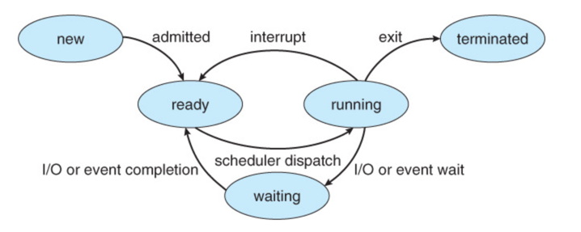

# 프로세스 동기화에 대해 설명해보세요.

### 인터럽트와 커널모드


## 인터럽트란?
CPU의 정상적인 프로그램 흐름을 방해하는 것.

인터럽트가 발생하면 cpu 에서는 즉각적으로 인터럽트 처리를 위해 커널 코드를 커널모드에서 실행한다.

= 커널이 인터럽트를 처리하기 위해 cpu 에서 주도적으로 실행이 된다!

### 인터럽트 종류
1. 내부 인터럽트 - 트랩이라 하기도 함 -> 소프트웨어 인터럽트
   1. 실행할 수 없는 명령어: 명령어의 비트 패턴이 정해지지 않은 경우
   2. 명령어 실행 오류: 0 으로 나누었을 때
   3. 사용 권한 위배: 사용자가 운영체제만 접근할 수 있는 영역에 접근
   
    그 밖에 잘못된 메모리 공간에 접근을 시도할 때 등이 존재한다.
2. 외부 인터럽트 - 주로 입출력 장치에 의해 발생한다.
   1. 입출력 인터럽트
   2. 타이머 인터럽트
   
   그 밖에 하드 웨어 고장- 컴퓨터 고장, 전원이 나간 경dn, 데이터 전달 과정에서의 비트 오류 도 있다.

> 전원에 문제가 생긴 경우, I/O 작업이 완료된 경우, 시간이 다 된 경우 - timer, 0으로 나눈 경우 - trap, 잘못된 메모리 공간에 접근한 경우 - trap
> 
> trap: 프로그램 레벨에서 발생한 인터럽트

## 시스템 콜
프로그램이 os 커널이 제공하는 서비스를 이용하고 싶을 때 시스템 콜을 통해서 실행한다.

시스템 콜 발생 시 해당 커널 코드가 커널 모드에서 실행된다.

> 커널의 역할: 프로세스 제어, 메모리 관리, 파일 시스템, 입출력 제어, 시스템 정보 제공,
> 프로세스 통신, 시스템 및 자원 보호, 타이머 및 시간 제어, 네트워킹, 디바이스 드라이버 관리 등 다양한 역할을 수행한다.

### 시스템 콜 종류
1. 프로세스, 스레드 관련
2. 파일 I/O 관련
3. 소켓 관련
4. 장치 관련
5. 프로세스 통신 관련

> 스레드를 만드는 것은 엄밀히 말하면 시스템 콜을 호출해야만 한다.
이게 그냥 코드 레벨로 구현이 가능한 이유가 우리가 흔히 쓰는 프로그래밍 언어가 시스템콜을 랩핑하여 간접적으로 사용할 수 있도록 제공했기 때문이다.
이런 맥락에서 자바의 스레드 클래스 코드를 까보면 JNI 인터페이스 를 통해 기반이 되는 OS 의 시스템 콜을 호출하는 것을 확인할 수 있다.
> 따라서 개발자는 프로그래밍언어를 통해서 간접적으로 시스템 콜을 사용할 수 있는 것이다.

### 프로세스의 상태

* scheduler: cpu 가 놀지 않고 일을 계속 하도록 ready queue에서 적합한 프로세스를 선택하는 역할(running 상태로 진입할 프로세스를 선택하는 역할이라고 봐도 좋을 것 같다.)
* ready queue: cpu 에서 실행되길 원하는 프로세스들이 모여있는 큐
* cpu scheduler: cpu에서 실행될 프로세스를 선택하는 역할
* dispatch: 스케줄러가 선택한 프로세스를 실제로 cpu 에서 실행될 수 있도록 만드는 역할 즉!! 선택된 프로세스에게 cpu 를 할당하는 역할
-> context switching  - 커널 모드, 새롭게 선택 된 프로세스의 유저 모드로 전환, 새롭게 선택된 프로세스의 실행되어야할 적절한 위치로 프로세스를 이동시키는 역할

### 스케쥴링 선점 방식
1. 비선점형 스케줄링
   * running 상태의 프로세스가 terminated
   * 다른 i/o 작업을 하러감
   * 자발적으로 cpu 를 다른 프로세스에게 양보 

   > 핵심은 자발적으로, 운영체제가 강제적으로 개입하지 않는다. 
   신사적, 협력적(cooperative - 스스로 실행하다가 turn 을 넘긴다.) , 느린 응답성

2. 선점 스케쥴링
    * 프로세스가 cpu 에서 실행이 다 끝나지 않았음에도 개입해서 프로세스의 상태를 ready 상태로 바꾸는 것
    * 우선순위가 높은 프로세스를 먼저 실행시키고자 하는 것

    > 적극적, 강제적, 빠른 응답성, 데이터 일관성 문제

### 스케줄링 알고리즘 (* 추후 정리)
Ready Queue 에서 기다리고 있는 프로세스를 어떤 기준으로 선택할 건지에 대한 알고리즘.

1. FCFS
2. SJF: 프로세스의 다음 cpu burst 가 가장 짧은 프로세스부터 실행
3. SRTF: 남은 cpu burst 가 가장 짧은 프로세스부터 실행(2+ 선점)
4. Priority: 우선순위가 높은 프로세스부터 실행
5. RR: 타임 슬라이스로 나눠진 cpu time 을 번갈아가며 실행
6. Multilevel queue
---
## 경쟁조건, 동기화, 임계영역 개념 정리

### (1) Race Condition
개념: 여러 프로세스 혹은 스레드가 공유된 자원에 동시에 접근해 실행의 순서나 타이밍에 따라 예측
할 수 없는 결과가 발생하는 상황
원인: 공유 변수나 자료구조에 대한 동시적인 읽기 및 쓰기 연산
예시: 두 스레드가 동시에 공유 변수를 증가시키는 작업을 수행할 때, 예측할 수 없는 결과가 발생하는 상황
> 공유 자원에 대한 동시적인 접근으로 인한 예측 불가능한 결과를 설명하는 개념이 경쟁조건


### (2) Synchronization
여러 프로세스, 스레드를 동시에 실행해도, (Race Condition 없이) 공유 데이터의 일관성을 유지하는 것


#### Synchronization 방법
싱글코어, 멀티코어에서 모두 동기화 하는 방법: 명령어를 한 스레드만 실행하도록 하는 법.

### (3) Critical Section
개념: 공유 데이터의 일관성을 보장하기 위해 ```하나의 프로세스 혹은 스레드만 진입해서 실행 가능한 영역```
> 하나의 프로세스 혹은 스레드만 진입해서 실행하는 것이 mutual exclusion


#### Critical Section Problem
개념: 임계영역 문제는 여러 프로세스나 스레드가 임계영역에 동시에 접근하면서 발생할 수 있는 동기화 문제

#### Critical Section Problem 의 해결책이 되기 위한 조건
1. mutual exclusion
2. progress
3. bounded waiting

3가지 조건을 모두 만족해야 해결책이 될 수 있다.

> 자바의 SimpleDateFormat 이라는 클래스는 동기화가 되지 않는다. 그러나 자바 8 이후 등장한 time 패키지의 날짜 관련 메소드는 동기화를 보장한다.

---
### 동기화 방법, 상호 배제를 달성하는 법
< 기본적인 뼈대 >
```java
do{
    entry section
    	critical section
    exit section
    	remainder section
} while(TRUE)
```
1. 스핀락
```java
volatile int lock = 0; // global

void critical() {
  while(test_and_set(&lock) == 1); // lock을 획득하려는 시도를 함
  [... critical section] // lock을 얻었다면, 임계 영역으로 진입
  lock = 0; // 작업이 끝난 후, lock을 반환
}

int TestAndSet(int* lockPtr) {
    int oldLock = *lockPtr;
    *lockPtr = 1; // 반환하기 직전에 lock의 값을 1로 바꿔줌
    return oldLock;
}
```
CPU 의 atomic 한 명령어인 TestAndSet 을 수행함으로써 상호배제를 달성한다.

> Atomic 명령어의 특징
> 
>    - 실행 중간에 간섭받거나 중단되지 않는다.
>    - 같은 메모리 영역에 대해 동시에 실행되지 않는다, 즉 동시에 호출이 일어나도 CPU level에서 이를 방어합니다 

이 방법은 쉽게 Mutual Exclusion 을 구현할 수 있다는 장점이 있지만 
스레드가 계속 락이 존재하는지 확인하고, 락을 획득하는데 오랜 시간이 걸릴 경우 많은 CPU자원을 불필요하게 
소모한다는 단점이 있다.

이를 해결하기 위해 Lock 이 준비될 때까지 기다리고 있는 Mutex 기법이 등장한다.

2. Mutex - 락을 가질 수 있을 때 까지 휴식하는 방식
```java
class Mutex{
    int value = 1; // 임계 영역에 진입하기 위해 이 value를 취득해야 함
    int guard = 0;
}
```

```java
Mutex::lock() {
    while(test_and_set(&guard));
    if(value == 0) { // 이미 누가 value를 취득한 상태라면 (lock을 획득할 수 없음)
        ... 현재 스레드를 큐에 넣음; // lock을 획득할 수 있을 때 깨워주기 위해 선입선출 구조인 Queue에 넣음
        guard = 0; & go to sleep
    } else { // lock을 획득할 수 있다면
        value = 0; // lock을 취득함
        guard = 0;
    }
}

Mutex::unlock() {
    while(test_and_set(&guard));
    if(큐에 하나라도 대기중이라면) { // ex) queue.isNotEmpty()
    	그 중에 하나를 깨운다; // ex) queue.poll()
    } else {
    	value = 1;
    }
    guard = 0;
}
```
- lock 에서는 lock 을 당장 획득할 수 없다면 FIFO 구조의 queue 에 현재 스레드를 넣고 sleep 상태가 된다.
- unlock 에서는 queue에 대기 중인 스레드가 존재한다면 스레드를 깨워 lock 을 부여한다.
- gurad 는 value 값을 임계영역에서 안전하게 바꿔주기 위한 장치이다.

> 항상 뮤텍스가 스핀락 보다 좋을 까?
> 
> cpu cycle가 낭비되는 것을 최소화 한다는 보통의 관점에서 스핀락보다 뮤텍스가 선호된다.
> 하지만 멀티 코어 환경이고, ```임계영역에서의 작업이``` 문맥 교환보다 빨리 이루어진다면 스핀락이 성능 상 더 좋다.
> ```멀티코어 환경```인 이유는 싱글 코어 환경에서는 락을 획득하는 과정에서 추가적인 문맥교환을 필요로하기 때문이다. 반면 멀티코어 환경에서는
> 락을 계속 확인하다가 락을 획득하는 과정에서 문맥교환이 발생하지 않는다.
>
> ```문맥 교환```은 현재 실행 중인 스레드의 상태를 저장하고 대기 중인 스레드의 상태를 복원하는 작업에서 발생한다.


반대로 임계영역에서의 작업이 길다면 스핀락 시간이 길어지고, 대기 중인 스레드들이 더 많아져 문맥교환 비용도 증가한다.
추가로 임계영역 작업이 긴 시간동안 락을 가지고 있으면서 다른 스레드들이 대기하는 동안 데드락이 발생할 수 있다.

3. Semaphore
Signal Mechanism을 가진, 하나 이상의 프로세스/스레드가 임계 영역에 접근하도록 하는 장치
```Java
class Semaphore {
    int value = 1; // mutex와 달리 0, 1, 2... 의 값을 가질 수 있음
    int guard = 0;
}
```
```java
Semaphore::wait() {
    while(test_and_set(&guard));
    if(value == 0) { 
        ... 현재 스레드를 큐에 넣음;
        guard = 0; & go to sleep
    } else {
        value -= 1; // mutex에서는 0으로 바꾸었지만, semaphore에서는 1씩 차감하는 형태
        guard = 0;
    }
}

Semaphore::signal() {
    while(test_and_set(&guard));
    if(큐에 하나라도 대기중이라면) { 
    	그 중에 하나를 깨운다;
    } else {
    	value += 1; // mutex에서는 1로 바꾸었지만, semaphore에서는 1씩 증가하는 형태
    }
    guard = 0;
}
```
전체적으로 Mutex 코드와 비슷하지만, 차이점으로는
value(lock) 을 Semaphore 는 1 이상의 가질 수 있는 부분과 락을 획득했을 때, 해제했을 때 
단순히 0, 1 로 바꾸는 것이 아닌, 현재 값에서 차감하고 증감하는 형태로 바뀐 부분이다.

이렇게 설정하는 이유는 Semaphore 는 임계 영역에 프로세스, 스레드가 하나 이상 들어가게 하기 위함이다
물론 value 값을 1로 설정해서 Mutex 와 같이 Semaphore 도 하나의 프로세스, 스레드만 임계영역에 진입
하게 할 수도 있다.

value 가 남은 것이 없다면 큐에 집어 넣고, value 가 남은 것이 있다면 그 수를 감소 시키며 공유할 수 있는 자원의 수를 감소시키고,
반대로 큐에 대기 중인 스레드가 있다면 해당 스레드를 깨우고, 대기중이 스레드가 없다면 공유할 수 있는 자원의 수를 증가시키며 공유자원을 관리한다고 보면 된다.

> 추가로!! Semaphore 가 시그널 매커니즘이라고도 불리는데 그 이유는 세마포어의 값(value)이
> 0인 경우 대기 중인 스레드 중 하나에게 시그널을 보내어 해당 스레드를 깨우고 실행할 수 있게 하기 때문이다.

value 값을 1로 가지는 Semaphore 를 binary Semaphore 라 하고,
value 값이 1이 아닌 값을 가지는 Semaphore 를 Counting Semaphore 라 한다.

그렇다면 Binary Semaphore 와 mutex 는 동일한 것일까? - 아니다
1. Mutex는 lock을 가진 자만 lock을 해제 할 수 있지만, Semaphore는 그렇지 않다.
Semaphore 는 wait 를 호출하는 존재와 signal 을 호출하는 존재가 다를 수 있다.
하지만 Mutex는 Lock 을 가진 프로세스나 스레드만이 Lock 을 해제할 수 있기에 누가 Lock을 해제할지 어느정도 예상할 수 있다.
2. Mutex는 Priority Inheritance 속성을 가지지만, Semaphore는 그렇지 않다.

---
> 2개의 프로세스 P1(High Priority), P2(Low Priority)가 있는데 P1의 우선순위가 더 높은 상황을 가정해 보면,
> 
1. P2가 먼저 lock을 획득하여 임계 영역에서 작업중이다.
2. 스케줄링이 진행되어서, P1이 lock을 획득하려 하고 있지만 P2가 점유하고 있어 작업을 진행하지 못한다. (P1은 P2가 lock을 반환하기 전까지 작업을 할 수 없게 됨, P1이 P2에 의존함)
3. 이 때, P2는 우선순위가 낮은 작업이므로 이 스케줄링 방식에서 언제 작업이 끝날지 모름(임계 영역 점유가 길어질 수 있음)
4. 따라서, P1은 우선순위가 높음에도 불구하고 아무 작업도 못하고 기다리고 있음

이러한 우선순위가 높은 작업이, 우선순위가 낮은 작업에 의해 실행되지 못하는 상황을
다시 말해, 상대적으로 우선순위가 가장 높은 프로세스인 'A'가 마치 우선순위가 가장 낮은 프로세스처럼 실행이 되는 현상을  우선순위 역전 현상 (Priority Inversion State)이라 한다.


1. P1이 P2에 의존하고 있는 이 상황에서, P2의 우선순위를 P1만큼 올려버린다.
2. 따라서, P2의 우선순위가 올라갔으므로 스케줄러가 P2를 실행시킨다
3. 이에 P2가 빠르게 임계 영역을 빠져나올 수 있게 됩니다.

(*) 2.3 번의 과정이 잘 이해가 안되긴 하지만 이 <a href="https://yabmoons.tistory.com/663"> 링크 </a> 를 참고해서 다시 정리 예정

이렇게 P2의 우선순위를 P1만큼 올려주는 이것을 Priority Inheritance라고 부른다.
Semaphore는 누가 lock을 해제할지(signal)알 수 없기 때문에 이러한 속성이 존재하지 않는다. 따라서,

```Mutual Exclusion(상호 배제)만 필요하다면 Mutex를, 작업 간의 실행 순서 동기화가 필요하다면 Semaphore가 권장된다.```

---

## DeadLock
두 개 이상의 프로세스 혹은 스레드가 서로가 가진 리소스를 기다리는 상태

### DeadLock 의 조건 
4가지 조건을 모두 만족해야한다.
1. Mutual Exclusion
* 리소스(임계영역, 락, CPU, 메모리, ssd, 프린터 등) 를 공유해서 사용할 수 없다.
2. Hold and Wait
프로세스가 이미 하나 이상의 리소스를 취득한(Hold) 상태에서 다른 프로세스가 사용하고 있는 리소스를 추가로 기다린다(wait)
3. No preemption
리소스 반환은 오직 그 리소스를 취득한 프로세스만 할 수 있다.
4. Circular wait
프로세스들이 순환 형태로 서로의 리소스를 기다린다.

### OS 의 데드락 해결방법
1. 데드락 방지 - 네 가지 조건 중 하나가 충족되지 않게 시스템을 디자인
   1. mutual exclusion -> 리소스를 공유 가능하게 함 (불가능)
   2. hold and wait -> 리소스 사용 효율이 떨어진다. 기아 현상이 발생 (불가능)
      1. 사용할 리소스들을 모두 획득한 뒤에 시작
      2. 리소스를 전혀 가지지 않은 상태에서만 리소스 요청
   3. no preemption -> 추가적인 리소스를 기다려야한다면 이미 획득한 리소스를 다른 프로세스가 선점 가능하도록, 양보 (cpu 의 문맥교환과 비슷)
   4. circular wait -> 모든 리소스에 순서 체계를 부여해서 오름 차순으로 리소스를 요청 (선호됨)
2. 데드락 회피 - 실행환경에서 추가적인 정보를 활용해 데드락이 발생할 것 같은 상황을 회피
    1. bankcer algorithm
   
       리소스 요청을 허락해줬을 때 데드락 발생 가능성이 있으면 리소스를 할당해돼 안전할 때까지 계속 요청을 거절하는 알고리즘
3. 데드락 감지와 복구 - 데드락을 허용하고 데드락이 발생하면 복구하는 전략
    1. 프로세스를 종료
    2. 리소스의 일시적인 선점을 허용
4. 데드락 무시 - 개발자에게 떠넘김 ~~

### 프로그램 레벨에서의 데드락 해결방법
