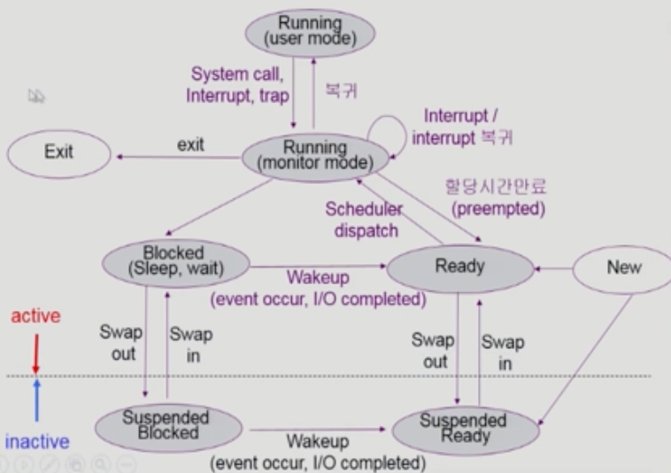

# 프로세스 동기화에 대해 설명해보세요.

### 운영체제
1. cpu 스케줄링
2. 메모리 관리
   - 페이지 단위 관리
3. 디스크 스케줄링
   - 디스크 헤드의 이동을 최소화하는 방향
4. 인터럽트와 캐싱- 빠른 cpu 와 느린 I/O 장치 간 속도차 극복 방법 

## 인터럽트란?
* 인터럽트가 발생하면 cpu 에서는 즉각적으로 인터럽트 처리를 위해 커널 코드를 커널모드에서 실행한다.
* CPU의 제어권이 운영체제에게 넘어간다.
* 인터럽트 당한 시점의 레지스터와 pc 를 save 한 후 cpu 의 제어를 인터럽트 처리 루틴에 넘긴다.

### 인터럽트 감지
인터럽트의 발생은 어떻게 감지?

인터럽트의 발생은 CPU 옆에 있는 인터럽트 라인(Interrupt Line)이 감지한다.
> 인터럽트 라인(Interrupt Line)은 컴퓨터 아키텍처에서 하드웨어 장치나 외부 이벤트가 발생했을 때, 중앙 처리 장치(CPU)에게 이 사건을 알리는 신호 경로

CPU가 하나의 명령어를 실행할 때마다 인터럽트 라인을 확인하며 인터럽트가 발생했는지 확인하는 것이다.
이 인터럽트 라인의 세팅에 의해 CPU가 운영체제에게 할당된다.
이 인터럽트 라인을 세팅하는 주체들에 따라 하드웨어 인터럽트와 소프트웨어 인터럽트로 나뉜다.
### 인터럽트 종류
1. 하드웨어 인터럽트: 하드웨어가 발생시킨 인터럽트(타이머, 디스크 등)
2. 소프트웨어 인터럽트(트랩)
   1. Exception : 프로그램이 오류를 범한 경우
   2. System call: 프로그램이 커널 함수를 호출하는 경우

### 인터럽트 관련 용어
* 인터럽트 벡터

  해당 인터럽트의 처리 루틴 주소를 가지고 있음
* 인터럽트 처리 루틴

   해당 인터럽트를 처리하는 커널 함수, 인터럽트 핸들러라고도 불림

### 인터럽트가 너무 자주 발생할 경우 대비해 DMA
* 빠른 입출력 장치를 메모리에 가까운 속도로 처리하기 위해 사용
* cpu 의 중재 없이 device controller 가 device 의 buffer storage 의 내용을 메모리에 블럭단위로 직접 전송한다.
* 바이트 단위가 아니라 블럭 단위로 인터럽트를 발생시켜 인터럽트 발생 횟수를 감소시킨다.
###  시스템 콜
프로그램이 os 커널이 제공하는 서비스를 이용하고 싶을 때 시스템 콜을 통해서 실행한다.
사용자 프로그램이 운영체제의 서비스를 받기 위해 커널 함수를 호출하는 것

> 커널의 역할: 프로세스 제어, 메모리 관리, 파일 시스템, 입출력 제어, 시스템 정보 제공,
> 프로세스 통신, 시스템 및 자원 보호, 타이머 및 시간 제어, 네트워킹, 디바이스 드라이버 관리 등 다양한 역할을 수행한다.

### 시스템 콜 종류
1. 프로세스, 스레드 관련
2. 파일 I/O 관련
3. 소켓 관련
4. 장치 관련
5. 프로세스 통신 관련

> 스레드를 만드는 것은 엄밀히 말하면 시스템 콜을 호출해야만 한다.
이게 그냥 코드 레벨로 구현이 가능한 이유가 우리가 흔히 쓰는 프로그래밍 언어가 시스템콜을 랩핑하여 간접적으로 사용할 수 있도록 제공했기 때문이다.
이런 맥락에서 자바의 스레드 클래스 코드를 까보면 JNI 인터페이스 를 통해 기반이 되는 OS 의 시스템 콜을 호출하는 것을 확인할 수 있다.
> 따라서 개발자는 프로그래밍언어를 통해서 간접적으로 시스템 콜을 사용할 수 있는 것이다.

### 프로세스의 상태

* scheduler: cpu 가 놀지 않고 일을 계속 하도록 ready queue에서 적합한 프로세스를 선택하는 역할(running 상태로 진입할 프로세스를 선택하는 역할이라고 봐도 좋을 것 같다.)
* ready queue: cpu 에서 실행되길 원하는 프로세스들이 모여있는 큐
* cpu scheduler: ready queue 에서 cpu에서 실행될 프로세스를 선택하는 역할
* dispatch: 스케줄러가 선택한 프로세스를 실제로 cpu 에서 실행될 수 있도록 만드는 역할 즉!! 선택된 프로세스에게 cpu 를 할당하는 역할
-> context switching  - 커널 모드, 새롭게 선택 된 프로세스의 유저 모드로 전환, 새롭게 선택된 프로세스의 실행되어야할 적절한 위치로 프로세스를 이동시키는 역할

### 스케줄링 선점 방식
1. 비선점형 스케줄링
   * running 상태의 프로세스가 terminated
   * 다른 i/o 작업을 하러감
   * 자발적으로 cpu 를 다른 프로세스에게 양보 

   > 핵심은 자발적으로, 운영체제가 강제적으로 개입하지 않는다. 
   신사적, 협력적(cooperative - 스스로 실행하다가 turn 을 넘긴다.) , 느린 응답성

2. 선점 스케쥴링
    * 프로세스가 cpu 에서 실행이 다 끝나지 않았음에도 개입해서 프로세스의 상태를 ready 상태로 바꾸는 것
    * 우선순위가 높은 프로세스를 먼저 실행시키고자 하는 것

    > 적극적, 강제적, 빠른 응답성, 데이터 일관성 문제

### 척도 
### 스케줄링 알고리즘 
Ready Queue 에서 기다리고 있는 프로세스를 어떤 기준으로 선택할 건지에 대한 알고리즘.

1. FCFS(First-Come-First-Served)
   - cpu burst 가 긴 프로세스가 먼저 도착하는 경우 waiting time 이 길어진다. (convoy effect- short process behind long process)


2. SJF: 프로세스의 다음 cpu burst 가 가장 짧은 프로세스부터 실행
   - mimimum average waiting time 을 보장 (optimal)
   - nonpreemptive : 일단 cpu 를 잡으면 이번 cpu burst 가 완료될때까지 cpu 를 선점당하지 않음
   - preemptive: 현재 수행중인 프로세스의 남은 burst time 보다 더 짧은 cpu burst time 을 가지는 새로운 프로세스가 도착하면 cpu 를 빼앗김 (SRTF)
3. SRTF(Shortest-Remaining-Time-First): 남은 cpu burst 가 가장 짧은 프로세스부터 실행 (2+ 선점) 
   - 장점: minimum average waiting time 보장 
   - 단점: long cpu burt time 을 가진 프로세스는 cpu 를 선점하지 못한다.
   - 단점: cpu burst time 을 미리 알지 못한다. -> 과거의 cpu burst time 을 이용해서 추정이 가능하긴하다.
4. Priority: 우선순위가 높은 프로세스부터 실행
   - SJF 도 일종의 우선순위(priority= predicted next cpu burst time)
   - 높은 우선순위를 가진 프로세스에게 cpu 할당
   - preemptive
   - nonpreemptive
   - 단점 : 기아현상
   - 단점 해결책: aging 기법 - 시간이 지날 수록 프로세스의 우선순위를 높여준다.
5. RR: 타임 슬라이스로 나눠진 cpu time 을 번갈아가며 실행
   - 각 프로세스는 동일한 크기의 할당 시간을 가진다.
   - 할당 시간이 지나면 프로세스는 선점당하고 Ready queue 의 제일 뒤에 가서 다시 줄을 선다
   - 할당 시간이 길면 FCFS 랑 유사
   - SJF 보다 average turnaround time이 길지만 response time이 짧다.
   - cpu burst time 이 다양할 경우 효과적이다.
6. Multilevel queue
   - foreground(Interactive job), background(long job, batch job) 으로 레디큐를 여러개로 분할
   - foreground - RR, background- FCFS
   - 기아 현상 발생
7. Multilevel feedback Queue
   - 프로세스가 다른 큐로 이동 가능
   - 기아현상을 에이징으로 해결
---
## 경쟁조건, 동기화, 임계영역 개념 정리

### (1) Race Condition
개념: 여러 프로세스 혹은 스레드가 공유된 자원에 동시에 접근해 실행의 순서나 타이밍에 따라 예측
할 수 없는 결과가 발생하는 상황

원인: 공유 변수나 자료구조에 대한 동시적인 읽기 및 쓰기 연산

예시: 두 스레드가 동시에 공유 변수를 증가시키는 작업을 수행할 때, 예측할 수 없는 결과가 발생하는 상황
> 공유 자원에 대한 동시적인 접근으로 인한 예측 불가능한 결과를 설명하는 개념이 경쟁조건


### (2) Synchronization
여러 프로세스, 스레드를 동시에 실행해도, (Race Condition 없이) 공유 데이터의 일관성을 유지하는 것


#### Synchronization 방법
싱글코어, 멀티코어에서 모두 동기화 하는 방법: 명령어를 한 스레드만 실행하도록 하는 법.

### (3) Critical Section
개념: 공유데이터에 접근하는 코드 조각의 일부이자, 공유 데이터의 일관성을 보장하기 위해 ```하나의 프로세스 혹은 스레드만 진입해서 실행해야 하체ㅕ 영역```


#### Critical Section Problem
개념: 임계영역 문제는 여러 프로세스나 스레드가 임계영역에 동시에 접근하면서 발생할 수 있는 동기화 문제

#### Critical Section Problem 의 해결책이 되기 위한 조건
1. mutual exclusion
   * 프로세스 P가 critical section 부분을 수행 중이면 다른 모든 프로세스들은 그들의 critical section에 들어가면 안된다.
       
2. progress
   * 아무도 critical section 에 있지 않은 상태에서 critical section 에 들어가고자하는 프로세스가 있으면 critical section에 들어가게 해주어야한다.
3. bounded waiting
   * 프로세스가 critical section 에 들어가려고 요청한 후 부터 그 요청이 허용될 때까지 다른 프로세스들이 critical section에 들어가는 횟수에 한계가 있어야한다. ( 기아현상이 없어야 한다. )

