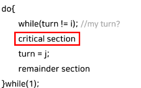
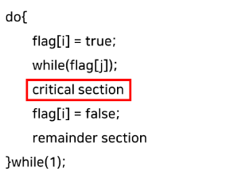
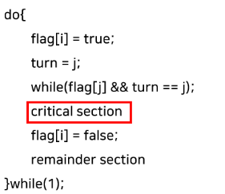
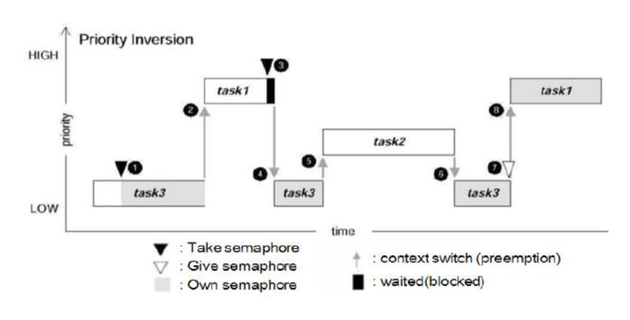
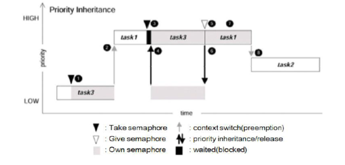
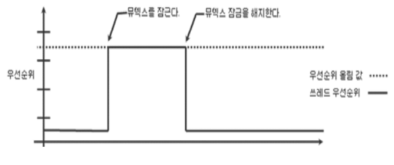
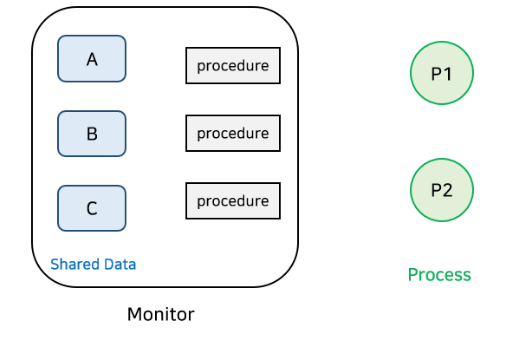
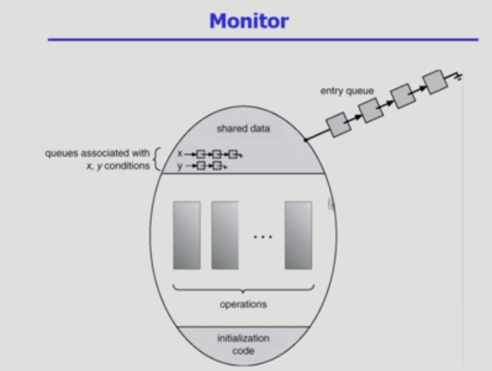

# 세마포어와 뮤텍스의 차이에 대해 설명해보세요.
### 동기화 달성 기법
1) 동기화 변수: turn



* Mutual Exclusion 만 만족한다.
* 특정 프로세스가 더 빈번하게 critical section 에 들어가야하지만 상대방이 critical section에 들어가지 않아 자기 차례가 오지 않는 과잉양보 문제 발생

2) 동기화 변수: flag[2]



* Mutual Exclusion 만 만족한다.
* 프로세스가 모두 flag=true 까지만 수행하고 나면 두 프로세스 모두 critical section 에 진입하지 못한다.

3) 동기화 변수 : flag[2], turn



* Mutual Exclusion, Progress, Bounded waiting 모두 만족한다.
* busy waiting 의 문제가 존재
* 프로세스가 2개인 경우에만 적용이 가능하고, 코드의 위치가 바뀐다면 제대로 동작하지 않음 - 현대의 컴퓨터에서 정상 작동 x


---
### 동기화 방법, 상호 배제를 달성하는 법
위의 세가지 코드 구현이 하드웨어와 소프트웨어 측면에서 다양하게 지원된다.


1. 하드웨어 지원 - busy waiting 스핀락
```java
volatile int lock = 0; // global

void critical() {
  while(test_and_set(&lock) == 1); // lock을 획득하려는 시도를 함
  [... critical section] // lock을 얻었다면, 임계 영역으로 진입
  lock = 0; // 작업이 끝난 후, lock을 반환
}

int TestAndSet(int* lockPtr) {
    int oldLock = *lockPtr;
    *lockPtr = 1; // 반환하기 직전에 lock의 값을 1로 바꿔줌
    return oldLock;
}
```
CPU 의 atomic 한 명령어인 TestAndSet 을 수행함으로써 상호배제를 달성한다.

> Atomic 명령어의 특징
>
>    - 실행 중간에 간섭받거나 중단되지 않는다.
>    - 같은 메모리 영역에 대해 동시에 실행되지 않는다, 즉 동시에 호출이 일어나도 CPU level에서 이를 방어합니다

이 방법은 쉽게 Mutual Exclusion 을 구현할 수 있다는 장점이 있지만
스레드가 계속 락이 존재하는지 확인하고, 락을 획득하는데 오랜 시간이 걸릴 경우 많은 CPU자원을 불필요하게
소모한다는 단점이 있다.

이를 해결하기 위해 Lock 이 준비될 때까지 기다리고 있는 Mutex 기법이 등장한다.

> 아래의 mutex 와 semaphore 모두 busy waiting 방식으로 구현할 수 있지만, cpu 자원을 절약하고자 block and wakeup의 아래 방식으로 구현한다.
2. Mutex - 락을 가질 수 있을 때 까지 휴식하는 방식

```java
class Mutex{
    int value = 1; // 임계 영역에 진입하기 위해 이 value를 취득해야 함
    int guard = 0;
}
```

```java
Mutex::lock() {
    while(test_and_set(&guard));
    if(value == 0) { // 이미 누가 value를 취득한 상태라면 (lock을 획득할 수 없음)
        ... 현재 스레드를 큐에 넣음; // lock을 획득할 수 있을 때 깨워주기 위해 선입선출 구조인 Queue에 넣음
        guard = 0; & go to sleep
    } else { // lock을 획득할 수 있다면
        value = 0; // lock을 취득함
        guard = 0;
    }
}

Mutex::unlock() {
    while(test_and_set(&guard));
    if(큐에 하나라도 대기중이라면) { // ex) queue.isNotEmpty()
    	그 중에 하나를 깨운다; // ex) queue.poll()
    } else {
    	value = 1;
    }
    guard = 0;
}

//
mutext->lock()
critical section
mutex->unlock()
```
- lock 에서는 lock 을 당장 획득할 수 없다면  FIFO 구조의 queue 에 현재 스레드를 넣고 sleep 상태가 된다.
- unlock 에서는 queue에 대기 중인 스레드가 존재한다면 스레드를 깨워 lock 을 부여한다.
- guard 는 value 값을 임계영역에서 안전하게 바꿔주기 위한 장치이다.

> 항상 뮤텍스가 스핀락 보다 좋을 까?
>
> cpu cycle가 낭비되는 것을 최소화 한다는 보통의 관점에서 스핀락보다 뮤텍스가 선호된다.
> 하지만 멀티 코어 환경이고, ```임계영역에서의 작업이``` 문맥 교환보다 빨리 이루어진다면 스핀락이 성능 상 더 좋다.
> ```멀티코어 환경```인 이유는 싱글 코어 환경에서는 락을 획득하는 과정에서 추가적인 문맥교환을 필요로하기 때문이다. 반면 멀티코어 환경에서는
> 락을 계속 확인하다가 락을 획득하는 과정에서 문맥교환이 발생하지 않는다.
>
> ```문맥 교환```은 현재 실행 중인 스레드의 상태를 저장하고 대기 중인 스레드의 상태를 복원하는 작업에서 발생한다.


반대로 임계영역에서의 작업이 길다면 스핀락 시간이 길어지고, 대기 중인 스레드들이 더 많아져 문맥교환 비용도 증가한다.
추가로 임계영역 작업이 긴 시간동안 락을 가지고 있으면서 다른 스레드들이 대기하는 동안 데드락이 발생할 수 있다.

3. Semaphore 추상자료형

Signal Mechanism을 가진, 하나 이상의 프로세스/스레드가 임계 영역에 접근하도록 하는 장치
```Java
class Semaphore {
    int value = 1; // mutex와 달리 0, 1, 2... 의 값을 가질 수 있음
    int guard = 0;
}
```
```java
Semaphore::wait() { //P
    while(test_and_set(&guard));
    if(value == 0) { 
        ... 현재 스레드를 큐에 넣음;
        guard = 0; & go to sleep
    } else {
        value -= 1; // mutex에서는 0으로 바꾸었지만, semaphore에서는 1씩 차감하는 형태
        guard = 0;
    }
}

Semaphore::signal() { //V 
    while(test_and_set(&guard));
    if(큐에 하나라도 대기중이라면) { 
    	그 중에 하나를 깨운다;
    } else {
    	value += 1; // mutex에서는 1로 바꾸었지만, semaphore에서는 1씩 증가하는 형태
    }
    guard = 0;
}

//
semaphore->wait()
critical section
semaphore->signal();
```
전체적으로 Mutex 코드와 비슷하지만, 차이점으로는
value(lock) 을 Semaphore 는 1 이상의 가질 수 있는 부분과 락을 획득했을 때, 해제했을 때
단순히 0, 1 로 바꾸는 것이 아닌, 현재 값에서 차감하고 증감하는 형태로 바뀐 부분이다.

이렇게 설정하는 이유는 Semaphore 는 임계 영역에 프로세스, 스레드가 하나 이상 들어가게 하기 위함이다
물론 value 값을 1로 설정해서 Mutex 와 같이 Semaphore 도 하나의 프로세스, 스레드만 임계영역에 진입
하게 할 수도 있다.

value 가 남은 것이 없다면 큐에 집어 넣고, value 가 남은 것이 있다면 그 수를 감소 시키며 공유할 수 있는 자원의 수를 감소시키고,
반대로 큐에 대기 중인 스레드가 있다면 해당 스레드를 깨우고, 대기중이 스레드가 없다면 공유할 수 있는 자원의 수를 증가시키며 공유자원을 관리한다고 보면 된다.

> 추가로!! Semaphore 가 시그널 매커니즘이라고도 불리는데 그 이유는 세마포어의 값(value)이
> 0인 경우 대기 중인 스레드 중 하나에게 시그널을 보내어 해당 스레드를 깨우고 실행할 수 있게 하기 때문이다.

value 값을 1로 가지는 Semaphore 를 binary Semaphore 라 하고,
value 값이 1이 아닌 값을 가지는 Semaphore 를 Counting Semaphore 라 한다.

#### 그렇다면 Binary Semaphore 와 mutex 는 동일한 것일까? - 아니다
1. Mutex는 lock을 가진 자만 lock을 해제 할 수 있지만, Semaphore는 그렇지 않다.
   ```Semaphore 는 wait 를 호출하는 존재와 signal 을 호출하는 존재가 다를 수 있다.```

   하지만 Mutex는 Lock 을 가진 프로세스나 스레드만이 Lock 을 해제할 수 있기에 누가 Lock을 해제할지 어느정도 예상할 수 있다.
2. Mutex는 Priority Inheritance 속성을 가지지만, Semaphore는 그렇지 않다.

---
> ### 우선순위 역전현상
>Task 1,2,3 이 각각 high, medium, low priority 를 가지며, Task 3 가 바이너리 세마포어를 지니고 있는 상황


1. Task 3 이 공유 자원을 엑세스 하기 위해 바이너리 세마포어를 가지고 수행
2. 운영체제 스케줄러에 의해 Task 1 실행
3. Task 1 이 Task 3 이 먼저 획득한 세마포어를 얻으려 하고, Task 3 이 그 세마포어를 반환할 때까지 대기 상태가 된다.(block 큐 진입)
4. 스케줄러에 의해 Task 3 실행
5. 스케줄러에 의해 Task 2 실행 - 우선순위 역전 현상 발생 💢
6. Task 2 가 종료되면 Task 3 실행
7. Task 3 가 세마포어 반환
8. Task 1 깨어나 수행됨
---

> ### 우선순위 역전 현상 해결
> 1. 우선순위 상속 기법
     > : task1이 task3이 갖고 있는 세마포어를 획득하기 위해 waiting한다면, task3의 우선순위를 task1만큼으로 임시적으로 높여주면 된다.
    
> 2. 우선순위 상한 기법:
     스레드가 세마포어(뮤텍스) 소유하는 동안 지정된 우선순위로 올림
    


Semaphore는 누가 lock을 해제할지(signal)알 수 없기 때문에 이러한 속성이 존재하지 않는다.
따라서,
```Mutual Exclusion(상호 배제)만 필요하다면 Mutex를, 작업 간의 실행 순서 동기화가 필요하다면 Semaphore가 권장된다.```
---
###  모니터


* 세마포어의 경우 wait, signal 연산순서를 바꿔서 실행하거나 둘 중 하나라도 생략 시 상호 배제를 위반해서 데드락이 발생한다.
  이 단점을 극복하기 위해 모니터가 등장했다.
* 모니터는 공유 데이터 구조, 공유 데이터에 대한 연산을 제공하는 프로시저, ```현재 호출된 프로시저``` 간의 동기화를 캡슐화한 모듈이다.
  프로세스가 공유 데이터를 사용하기 위해서는 반드시 모니터 내의 프로시저를 통해야한다. 그리고 동일한 시간에 오직 한 프로세스나 스레드만 모니터에 들어갈 수 있다.
  (-> 이 작업을 위해 mutex 가 사용되는 데 이 때 스레드가 자신의 순서를 얻기 위해 mutex 가 관리하는 entry queue 에 들어갔다가 나오는 작업이 반복됨)
  > 프로시저
  > * 공유자원에 대해 호출할 수 있는 연산을 모아놓은 것
  > * 공유자원과 프로시저는 1:N
  > * 공유자원에 대한 여러 연산을 모니터 단에서 원자적으로 조작하기 위해 프로시저가 등장
  > * ```공유자원을 함부로 조작하지 못하게 하기 위해. 잘못된 접근을 막아놓은 것, 보안이 목적임```
  > * 자바의 메소드와 비슷하다.
  > * 비유를 하자면, 자바의 모든 인스턴스는 모니터를 내부적으로 구현하고 있다. 해당 인스턴스의 인스턴스 변수(공유변수)에 접근하려면 인스턴스의 메소드를 통해야한다. 이 때 인스턴스의 메소드를 통해
  > * 공유변수를 조작하므로 인스턴스의 메소드는 프로시저이다. 즉, 프로시저는 개발자가 별도로 구현해야하는 것이다.

<br/>

* condition variable 이 존재하고 wait, signal 에 따라 큐에 쌓이거나 빠져나온다. (waiting queue로 여러개의 자원이 관리된다.)
* 자원의 값을 가지지 않고 큐에 프로세스를 넣거나 빼기만 한다. 락을 획득하는 과정이 없다.
* 모니터는 기본적으로 동시접근을 막아준다. - 동시접근의 문제를 개발자가 걱정할 필요가 없다. 프로그램이 책임져 준다.

### 자바 모니터
* 모니터는 자바와 같은 프로그래밍 언어 수준에서 제공되며, 자바에서는 모든 객체가 모니터를 가진다.
* 모니터의 mutual exclusion 기능은 ```synchronized``` 키워드로 사용한다.
* 자바에서는 condition variable 을 하나만 가진다. wait, notify, notifyAll 동작만 지원한다.

* Condition Variable은 특정 조건을 만족하기를 기다리는 변수이며, thread간의 신호 전달을 위해 사용한다.


---

https://j-i-y-u.tistory.com/21
