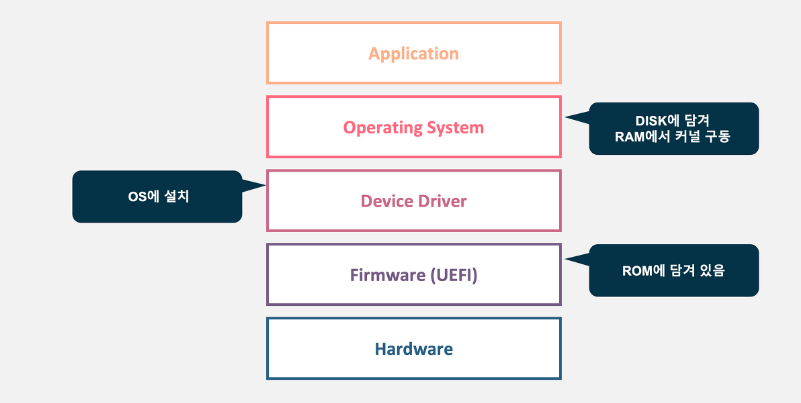
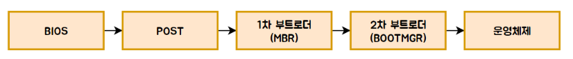
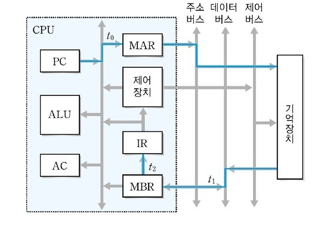
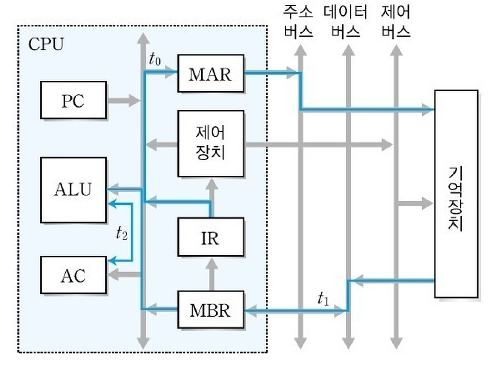

# 컴퓨터의 구성요소
1. 전원 공급 장치
2. 메인 보드
   * BIOS: 메인보드에 포함된 가장 먼저 실행되는 소프트웨어
3. 중앙 처리 장치
   * 명령어의 해석과 자료 연산, 비교 등의 처리를 제어하는 컴퓨터 시스템의 핵심장치
   * 다양한 입력 장치로부터 명령을 받아 처리한 후, 그 결과를 출력 장치로 보내는 일련의 과정을 제어하고 조정하는 일을 수행
   * 제어장치, 연산장치, 레지스터로 구성됨
   * 모든 컴퓨터의 과정은 CPU 의 제어를 받아야만 이루어진다.
   * CPU + 칩셋 -> 칩셋은 CPU를 도아 메모리나 I/O 장치를 제어하며 연관된 기능을 수행하도로 설계된 컨트롤러 칩들의 모임이다.
4. 입출력 장치
   * 컴퓨터와 사용자 사이의 정보를 교환할 수 있는 장치
   * 랜카드(NIC, 이더넷 카드- 맥 주소가 저장됨)가 있음
5. 주기억 장치
   * 컴퓨터 내부에서 현재 CPU가 처리하고 있는 내용을 기억하고 있는 장치
   * ROM - 시스템에 기억시키고 변화하면 안되는 BIOS 와 같은 주요 데이터가 저장된다.
   * RAM - 휘발성 메모리, 빠름, 응용프로그램/운영체제 등 불러와 CPU가 작업할 수 있도록 하는 기억장치
6. 보조 기억 장치
   * 물리적인 디스크가 연결되어 있는 기억장치
   * HDD: 물리적인 디스크를 고속으로 회전시켜 데이터를 저장하는 장치, 속도 느림
   * SSD: USB가 발전한 형태, 물리적으로 회전하거나 움직이지 않고 전기적으로 데이터를 저장, 속도 HDD에 비해 빠름. 가격이 비쌈

## 컴퓨터 전원을 켤 때 일어나는 일

### 부팅 절차
컴퓨터에 전원을 켰을 때 운영체제를 메모리에 올리는 과정을 부팅이라 한다.

1. 전원 공급 장치가 메인 보드에 전기를 공급
2. 부트 프로그램 실행
3. 하드웨어 검사
4. 운영체제 로드
5. 운영체제 실행

<자세히>

메인보드에 내장된 메인 메모리인 ROM의 바이오스가 실행하며 운영체제를 실행한다.
> 운영체제 
> - 커널(os 에서 HW 를 담당하는 부분, 핵심부분) +  쉘(커널과 사용자 간 인터페이스 담당)
> 
> 펌웨어
>  - 하드웨어의 기본적인 구동 및 제어를 담당하는 특수 용도의 소프트웨어, 하드웨어의 역할에 가깝고 형태는 소프트웨어에 가까움
>  - 펌웨어를 구동시켜주는 것이 장치 드라이버(OS 커널의 일부) , 운영체제와 하드웨어 사이의 매개체
>  - 운영체제가 주변장치를 인식하는 레이어
> 

   1. ROM에 저장된 BIOS(Basic Input/Output System) 시동 프로그램이 컴퓨터에 연결된 각종 하드웨어를 점검한다(Power-On Self-Test)
   2. POST 점검에 이상이 없으면, 하드디스크의 MBR(마스터 부트 레코드)에 저장된 부트스트랩 로더(부트로더)를 메모리에 로딩한다.
      * MBR은 운영체제가 어디에 저장되어있는지를 나타내며, 하드디스크의 첫번째 섹터에 위치한다.
      1. BIOS 가 연결된 저장매체를 설정된 부팅 순서대로 돌면서 MBR 에 저장된 부트로더를 탐색한다.
      2. 부트로더 탐색에 성공하면 BIOS 는 부트로더 프로그램을 메모리에 올린다.
      3. 그 후 CPU가 주기억장치 즉 메모리와 교류하며 작동을 한다.
   3. 메모리에 올라온 부트로더가 운영체제 프로세스를 실행한다.
      


## CPU 구성요소
1. 제어장치(Control Unit)
   * 기억장치로부터 프로그램 명령을 순차적으로 꺼내 해독하고, 해석에 따라 명령어 실행에 필요한 제어 신호를 기억장치, 연산장치, 입출력 장치 등으로 보내는 장치
   * 프로그램 카운터, 명령 해독기, 부호기, 명령 레지스터 등으로 구성됨
2. 연산장치(Arithmetic and Logical Unit)
   * 연산에 필요한 자료를 입력받아 산술, 논리, 관계, 이동 등 다양한 연산을 수행하는 장치
   * 가산기, 보수기, 누산기, 데이터 레지스터 등으로 구성됨
3. 레지스터
   * CPU 내에 존재하는 소규모의 고속 기억장치
   * ```명령어 주소, 코드, 연산에 필요한 데이터 및 연산결과``` 를 임시로 저장
   * 범용 레지스터, 특수 목적 레지스터 
   > 특수 목적 레지스터
   >  
   > * MAR(메모리 주소 레지스터): 읽기, 쓰기 연산을 수행할 주기억장치의 주소를 저장
   > * PC(프로그램 카운터): 다음에 실행될 명령어의 주소를 저장, 메모리에서 읽어 들일 명령어나 데이터의 주소를 저장
   > * SP(스택 포인터): 스택의 최상위 주소를 저장
   > * IX(인덱스 레지스터): 인덱스 주소 지정 방식에서 인덱스를 저장
   > * IR(명령어 레지스터): 명령어를 호출해 해독하기 위해 현재 명령어를 임시뢰 저장
   > * MBR(메모리 버퍼 레지스터): 주 기억장치의 내용을 임시로 저장하는 역할
   > * AC(누산기): 산술 논리 장치의 연산결과를 임시로 저장
   > * PSR(프로그램 상태 레지스터) : CPU 의 현재 상태 정보를 저장

### CPU 연산
Fetch - Decode - Execute- Writeback

### CPU 명령어
* 명령어 세트: CPU가 실행할 명령어 집합 = 연산코드(Op code) + 피연산자(Operand)
* 명령어 사이클
   * CPU가 주기억장치에서 한 번에 하나의 명령어를 인출하여 실행하는데 필요한 일련의 활동
   * 인출, 실행, 간접, 인터럽트 사이클
   
   * 명령어 인출 사이클과 특수 목적 레지스터 동작 과정
   
     1. 프로그램 카운터(PC)에 저장된 주소를 메모리 주소 레지스터(MAR)로 전달 한다.
     2. 메모리 주소 레지스터(MAR)에 저장된 내용을 토대로 주기억장치의 해당 주소에서 명령어를 인출한다.
     3. 인출한 명령어를 메모리 버퍼 레지스터(MBR)에 저장한다.
     4. 다음 명령어를 인출하기 위해 프로그램 카운터 (PC)의 값을 증가 시킨다.
     5. 메모리 버퍼 레지스터(MBR)에 저장된 내용을 명령어 레지스터(IR)에 전달한다.
      
      ```
     T0 : MAR <- PC
     T1 : MBR <- M[MAR], PC <- PC + 1
     T2 : IR <- MBR 
     ```
     
   * 명령어 실행 사이클과 특수 목적 레지스터의 동작 과정
   
     1. 명령어 레지스터(IR)의 내용을 메모리 주소 레지스터(MAR)로 전달한다.
     2. 메모리에 저장된 데이터 값을 메모리 버퍼 레지스터(MBR)에 저장한다.
     3. 누산기(AC)에 저장된 값에 ADD연산을 실행한다.
     
     ```
     ADD addr 명령어 연산
     T0 : MAR <- IR(Addr)
     T1 : MBR <- M[MAR]
     T2 : AC <- AC + MBR
     ```
## 시스템 버스
* 컴퓨터의 구성요소를 연결하고 데이터 전달을 위한 경로
* 주소, 데이터, 제어 버스로 구성

1. 데이터 버스
   * cpu 와 (기억장치, IO 장치) 사이에서 데이터를 전송하는데 사용되는 통로
     * (기억장치, IO 장치) 의 명령어와 데이터를 CPU 로 보낸다
     * CPU 연산 결과를 (기억장치, IO 장치) 로 보낸다.
   * 양방향 전송
   > 데이터 버스 역할
   > * 주소 버스를 통해 주기억장치는 MAR 로 부터 메모리 주소값을 전달받는다
   > * 해당 메모리 주소에 있는 데이터를 MBR에 전달한다.
   > * 이 과정에서 주기억장치로부터 MBR에 데이터를 전달하는 것이 데이터 버스 역할
   > * 
2. 주소 버스
   * CPU -> (주 기억장치, IO 장치) 로 기억장치 주소, IO 장치 포트 번호를 전달하는 통로
   * 주소만 전달하기에 단방향 버스
   * 단방향 전송
   > 주소 버스의 역할
   > * PC에서 어떤 메모리 주소의 데이터를 MAR 에 요청한다.
   > * MAR은 해당 메모리 주소의 데이터를 주기억장치에게 전달한다
   > * MAR 에서 메모리 주소값을 주기억장치에게 전달하는 것이 주소버스 역할
   >
   >
3. 제어 버스
   * 데이터버스, 주소 버스를 제어하기 위해 제어신호들을 전송하는 통로
   * 읽기, 쓰기 동작을 모두 수행하기 대문에 양방향 버스
     * Read와 Write신호가 전달

> #### CPU <----> 메모리
> - 적재(Load)와 저장(Store) 명령에 의해 수행
> 1. 적재(Load)
> - 주소 버스 : 메모리에서 불러올 데이터가 저장된 주소값이 전달(CPU -> Memory)
> - 신호 버스 : Memory Read 신호 전달(CPU -> Memory)
> - 데이터 버스 : 지정한 메모리에 저장된 값 전달(Memory -> CPU)
> 2.  저장(Store)
> - 주소 버스 : 메모리에서 해당 데이터를 저장할 주소값 전달(CPU -> Memory)
> - 신호 버스 : Memory Write 신호 전달(CPU -> Memory)
> - 데이터 버스 : 저장할 데이터 전달(CPU -> Memory)


한 개의 Instruction은 여러 개의 Micro Operation이 동작되어 실행된다
위에서 적재, 저장에서 3개의 마이크로 오퍼레이션이 동작 하나(적재, 저장) 를 결정한다.
