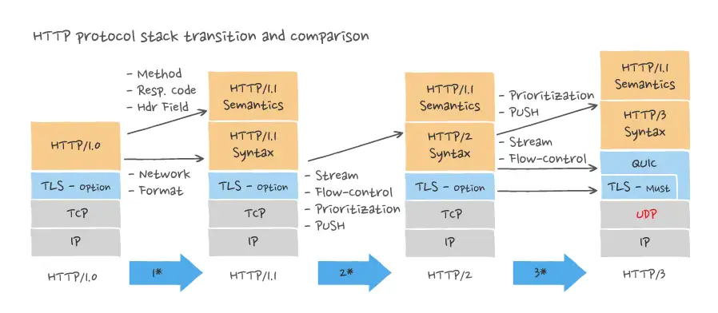

# 네트워크

## HTTP와 HTTPS의 차이점에 대해서 설명해보세요.

---

### HTTP란?

HTTP (**H**yper**T**ext **T**ransfer **P**rotocol)

하이퍼텍스트를 전송하기 위해 고안된 프로토콜.  
OSI 7계층의 applicaiton 계층 및 TCP/IP 계층의 application 계층에 속한다.  

HTTP는 요청과 응답으로 나뉜다.

### HTTPS란?

HTTPS(**H**yper**T**ext **T**ransfer **P**rotocol **S**ecure)

HTTP는 암호화되지 않은 데이터를 전송한다.  
따라서 통신하는 주체가 서로 신뢰할 수 있는지를 알아야 한다.  
HTTPS는 TLS라는 프로토콜을 통해 보안을 강화했다.

### TLS란?

TLS (**T**ransport **L**ayer **S**ecurity)

SSL (Secure Sockets Layer)를 개선한 기술.  
현재 근본적인 의미의 SSL은 존재하지 않지만, 아직도 TLS를 SSL로 혼용해서 부르고 있다.  

TLS는 통신하는 주체가 서로 신뢰할 수 있도록 하는 기술로, 다음과 같은 handshake 과정을 거친다.

1. 클라이언트가 서버에게 TLS에 필요한 정보가 담긴 요청을 보낸다.
2. 서버가 클라이언트에게 서버 인증서를 포함한 TLS에 사용할 정보가 담긴 응답을 보낸다.
3. 클라이언트가 서버의 인증서를 검증한다.
4. 클라이언트가 서버의 인증서에 담긴 공개키로 암호화하여 secret을 생성하고 서버에 보낸다.
5. 서버가 secret을 개인키로 복호화한다.
6. 서버가 세션키를 생성하고 클라이언트에게 보낸다.
7. 클라이언트가 세션키로 암호화한 완료 메시지를 서버에게 보낸다.
8. 서버가 세션키로 암호화한 완료 메시지를 클라이언트에게 보낸다.

여기서 인증서는 CA (Certificate Authority, 인증 기관)에서 발급한다.  
CA가 되기 위해서는 OS, 브라우저 기업 등이 정한 요건들을 만족한 후 신청해야 한다.  
즉, 신뢰할 수 있는 기업에서 인정한 CA에서 인증서를 발급할 수 있도록 한다.

### TLS 1.2

TLS 1.2에서는 세션키를 교환한 이후에는 재연결 시 곧바로 세션키를 사용하여 handshake 함으로써 이전의 불필요한 과정을 생략하고자 했다.

### TLS 1.3

TLS 1.3에서는 handshake가 일어난 후에는 PSK (Pre-Shared Key)를 교환한다.  
다음 연결에는 곧바로 PSK로 암호화함으로써 TLS handshake 과정을 없앴다.  

### HTTP/3

HTTP/3에는 QUIC라는 프로토콜을 사용한다.  
QUIC는 UDP와 TLS를 사용함으로써 기존에 필요했던 TCP handshake 과정조차 없앴고, 진정한 의미의 0-RTT를 달성했다.    

0-RTT는 첫 요청부터 곧바로 데이터를 보냄으로써 매우 빠른 속도를 보장하지만, 동시에 보안의 문제가 발생한다.  
데이터 자체는 암호화되어 있기 때문에 데이터 정보는 알 수 없지만, 해커가 같은 요청을 반복해서 보냄으로써 문제를 야기할 수는 있다.  
따라서 일반적으로 멱등성이 보장되어 있지 않은 요청에 대해서는 0-RTT를 권장하지 않는다.

---

### 요청
- Request line: method, url, 프로토콜 버전으로 구성되어 있다.
  - method
    - 어떤 종류의 요청인지를 명시한다.  
    - REST api 구현에 사용되는 GET, POST, PUT, PATCH, DELETE 가 대표적이다.
  - url
    - 요청을 보내는 목적지를 나타내는 주소이다.
  - 프로토콜 버전
    - HTTP/X (e.g. HTTP/1.1)와 같은 형식으로 나타낸다.
- Header
  - 리소스를 제외한 부수적인 정보들을 담는다.
  - 언어나 보안 등에 사용되는 정보들을 포함한다.
- Body
  - 통신의 목적이 되는 리소스를 담는다.
  - 일반적으로 GET, DELETE 요청은 body를 채우지 않는다.  

### 응답
- Status line: 프로토콜 버전, 상태 코드, reason phrase로 구성되어 있다.
  - 프로토콜 버전
    - HTTP/X (e.g. HTTP/1.1)와 같은 형식으로 나타낸다.
    - 요청의 버전과 다를 수 있다.
  - 상태 코드
    - 세 자리 숫자로 구성되어 있다. 맨 앞자리는 1~5의 범위로, 각각의 숫자가 의미하는 바가 다르다.
    - 1XX(정보): 임시 응답으로서, 클라이언트가 요청을 계속하거나 응답을 무시해도 됨.  
    - 2XX(성공): 요청에 대한 작업을 성공적으로 완료함.
    - 3XX(리다이렉션): 요청을 완료하기 위해 추가적인 작업이 필요함.
    - 4XX(클라이언트 오류): 잘못된 요청을 보냄.
    - 5XX(서버 오류): 서버에 오류가 발생함.
  - Reason phrase
    - 상태 코드에 대한 부연 설명으로, 적지 않아도 된다.
- Header
  - 리소스를 제외한 부수적인 정보들을 담는다.
  - 서버의 상태, 요청에 대한 일부 정보, 리소스의 유형 등을 포함한다.
- Body
  - 통신의 목적이 되는 리소스를 담는다.
  - 웹 문서를 요청한 경우 일반적으로 HTML 코드가 담긴다.
