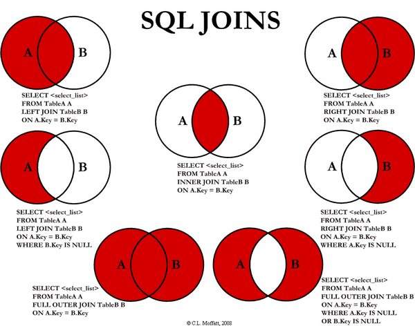

# 데이터베이스

## JOIN에 대해서 설명해주세요.

---

### JOIN이란?

DB에서 연관 관계에 있는 다른 테이블과 함께 쿼리하기 위한 명령어.

### JOIN diagram

1. `INNER JOIN`: 두 테이블 모두에 존재하는 데이터.

2. `LEFT/RIGHT (OUTER) JOIN`: `JOIN` 문 왼쪽/오른쪽에 있는 테이블의 데이터.  
`WHERE [table].[column] IS NULL` -> 공통 부분 제외.

3. `FULL OUTER JOIN`: 두 테이블 중 한 곳에라도 존재하는 데이터.  
`WHERE [table1].[column] IS NULL OR [table2].[column] IS NULL` -> 공통 부분 제외

