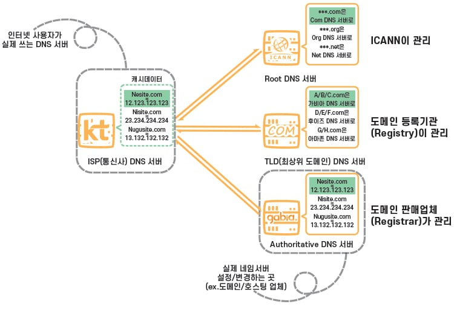
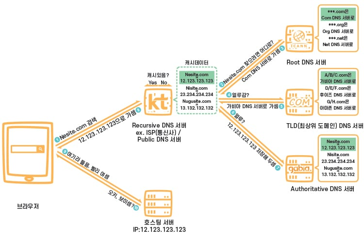

# 브라우저에 URL을 입력했을 때 일어나는 일에 대해 설명해주세요.

1. 사용자가 브라우저에 URL을 입력한다.

<참고>
`https://www.naver.com`
-> 프로토콜 : https
-> 도메인 네임 : naver.com
-> 호스트 네임 : www

인터넷에서 호스트간 연결을 위해서는 IP 주소가 필요하다.
이를 위해 IP 주소를 찾기 시작한다.

2. 해당 도메인 네임 내에 있는 호스트에 대한 IP 주소의 설정값을 찾는다.
- 로컬 내에 hosts 파일에서 해당 도메인에 대한 IP가 매핑되어있는지 확인한다.
- 없다면, 로컬 DNS Cache를 확인한다. ( DNS Cache는 Local의 RAM 메모리 상에 존재한다. )
- 없다면, ISP DNS 서버로 DNS Query를 날린다.
- DNS Server에서 TLD 도메인 네임 서버 - com 도메인 네임 서버 - naver.com 도메인 네임 서버를 거쳐
 `www.naver.com` 의 IP 주소를 획득해온다. (*)

3. (Optional) 만약, 2번의 과정에서 로컬 DNS Cache를 통해 서버의 IP를 획득한 것이 아니라면,
   DNS Cache에 도메인 - IP 주소 내용을 캐시한다.

4. 획득한 IP를 기반으로, 해당 서버와 TCP연결을 수립한다. ( 3-way handshake, 4-way handshake )

5. 클라이언트에서 서버로 HTTP Request를 날린다.

6. 서버에서 클라이언트로 HTTP Response를 돌려준다. 

7. 클라이언트는 서버에서 받은 Response를 이용해 화면을 렌더링한다.

8. 클라이언트는, 해당 정적 파일들 ( html, css, js, img들.. )을 Disk에 캐시해놓고,
추후 접속시도 시, 변화된 값이 있는지만 확인하고
전체 내용을 네트워크를 통해 다운로드 받지 않고, 디스크에서 데이터를 가져온다.

---
### (*) DNS 서버 종류 및 작동원리

[1] ISP DNS Server ( Recursive DNS Server )
- 앤드포인트 유저가 가장 먼저 접근하는 DNS 서버
- TTL(Time to Live) 동안 캐시 저장을 통해 효율성 증대

[2] Root DNS Server
- ICANN( DNS 총괄 기구 )가 관리한다.
- TLD DNS 서버의 IP들을 관리한다.

[3] TLD DNS Server
- TLD(Top Level Domain), 도메인 등록 기관(Registry)에서 관리하는 서버
- 도메인 판매 없체 ( Registrar )에서 DNS 설정 변경 시, Registry로 전달
- 해당 원리로 TLD DNS 서버는 Registry에서 관리한다.

[4] Authoritative DNS Server
- 개인 도메인과 IP 주소의 관계가 관리되는 서버
- 도메인 호스팅 업체, 개인 서버가 이에 포함됨.

