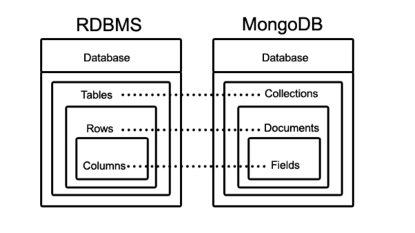

### MongoDB에 대해 간단히 설명해주세요.

### MongoDB
- 문서(Document) 지향적인 NoSQL 데이터베이스
- 대량의 비정형 데이터를 저장하고 처리하는데 사용된다.

### 문서 지향적 ( Document - Oriented )
- DB System의 한 종류
- MongoDB에서는 비정형 데이터를 관리하기 위해 문서(Document)라는
개념을 중심으로 데이터를 구성한다.

```java
// DB 선택
MongoDatabase database = mongoClient.getDatabase("myDB");

// 컬렉션 선택
MongoCollection<Document> collection = database.getCollection("myCollection");

// 새로운 문서 생성
Document document = new Document("name", "Jun")
        .append("age", 28)
        .append("email", "jun@example.com");

// 문서 삽입
collection.insertOne(document);
System.out.println("새로운 문서가 삽입되었습니다. ID : " + document.get("_id"));
```

### 컬렉션 ( Collection )
- 비정형 데이터인 문서(Document)의 그룹
- `비슷한` 유형의 문서들을 논리적으로 모아서 저장하는 단위
```json
// Persion Document
{
  "_id" : ObjectId("61e0d934a4b2d3e3aef3e6f"),
  "name" : "Jun",
  "gender" : "male",
  "age" : 28,
  "address" : "Seoul"
}
```

- 아래와 같이 여러개의 Document가 하나의 Collection을 이룬다.

```json
[
  {
    "_id": ObjectId("61e0d934a4b2d43e3aef3e6f"),
    "name": "John",
    "gender": "남",
    "age": 30,
    "address": "New York"
  },
  {
    "_id": ObjectId("61e0d934a4b2d43e3aef3e70"),
    "name": "Alice",
    "gender": "여",
    "age": 25,
    "address": "London"
  },
  {
    "_id": ObjectId("61e0d934a4b2d43e3aef3e71"),
    "name": "Michael",
    "gender": "남",
    "age": 35,
    "address": "Los Angeles"
  }
]
```

### NoSQL
- "Not Only SQL"의 약어
- 관계형 DB ( MySQL )와 달리 쿼리가 아닌 메소드/API를 사용
- Document 클래스를 사용하여 문서를 생성하고, 필드와 값을 추가하여
insertOne(), find(), updateOne(), deleteOne() 등의 메소드를 사용하여 데이터를 조작한다.

### 비정형 데이터
- MongoDB는 JSON 형식의 문서로 데이터를 저장함.
- 문서는 BSON ( Binary JSON ) 형태로 저장됨.
( 네트워크를 통해 이동할 때나, 저장될 때는 BSON / 유저에게 보여줄 때는 JSON 형식)
- 하나의 문서에는 여러 필드와 값이 포함될 수 있다.
- MongoDB의 컬렉션 ~= RDB의 테이블
- 각 문서는 고유한 식별자인 ObjectId를 가짐 ( 자동 생성 )

### MongoDB의 특징
- 문서 지향적
  - JSON 형식의 문서를 중심으로 데이터를 저장함.
- 스케일 아웃 가능 (Scalable)
  - 분산 아키텍처로 수평적인 확장이 가능, 대용량 데이터 처리에 용이
- 유연한 데이터 모델 ( Flexible Schema )
  - 스키마를 사전에 정의하지 않고, 유연하게 데이터를 저장하고 수정할 수 있음.
