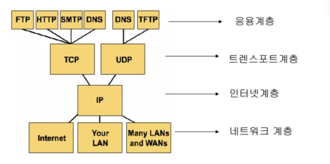
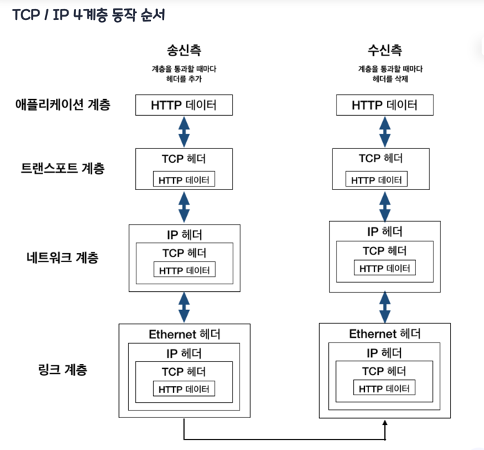

### OSI 7 Layer와 TCP/IP 4 Layer

### OSI 7 Layer
- 네트워크 통신이 일어나는 과정을 7단계로 나눈 것

### OSI 7 계층, 나눈 이유는?
- 흐름을 한 눈에 알아보기 쉽다 ( 이해하기 쉽다 )
- 특정한 곳에 이상이 생기면, 다른 단계의 장비/소프트웨어를 건들이지 않고도 이상이 생긴 단계만 고칠 수 있기 때문이다.

### OSI 7 Layer와 PDU(Protocol Data Unit)
7 ~ 5 Layer
- 데이터 ( 응용, 표현, 세션 )
4 Layer
- 세그먼트 ( 전송계층 )
3 Layer
- 패킷 ( 네트워크 계층 )
2 Layer
- 프레임 ( 데이터 링크 계층 )
1 Layer
- 비트 ( 물리 계층 )

### 물리 계층 ( Physical Layer, L1 )
- 전기적 신호가 나가는 물리적인 장비
- 데이터를 전달할 뿐, 전송하려는 데이터가 무엇인지/에러가 있는지 여부는 신경쓰지 않음
- 데이터를 전기적인 신호로 변환해서 주고받는 기능만을 가진다.
- PDU : 비트
- 장비 : 케이블, 허브, 리피터

### 데이터 링크 계층 ( Data Link Layer, L2 )
- 물리계층을 통해 송수신되는 정보의 오류와 흐름을 관리 ( 오류제어, 흐름제어 )
- 안전한 정보의 전달을 수행하도록 한다.
- 통신에서의 오류도 찾아주고, 재전송 기능도 있음.
- 장치의 MAC 주소를 이용하여 통신한다.
- Point-To-Point 간 신뢰성 있는 전송을 보장한다
- CRC 기반의 오류 제어 및 흐름 제어가 필요함.
- PDU : Frame

- 흐름 제어 : 송신 측과 수신 측의 속도 차이를 조정
- 오류 제어 : 오류 검출 및 회복
- 순서 제어 : 프레임의 순서적 전송
- 프레임 동기화 : 프레임의 시작과 끝을 구별하는 동기화
- 장비 : 브릿지, 스위치, 이더넷

### 네트워크 계층 ( Network Layer, L3 )
- 경로(Route)와 주소(IP)를 정하고 패킷을 전달해주는 것이 역할
- 목적지까지 가장 안전하고 빠르게 데이터를 보내는 기능
- 최적의 경로를 설정할 필요가 있음. ( 라우팅 )
- PDU : Packet / Datagram

### 전송 계층 ( Transport Layer, L4 )
- 양 끝단의 사용자들 간의 신뢰성 있는 데이터를 주고받게 하는 역할
- 송신자와 수신자 간의 신뢰성 있고 효율적인 데이터 전송
- 오류 검출 및 복구, 흐름제어, 중복검사 등을 수행
- 데이터 전송을 위해 `포트 번호` 사용
- TCP, UDP와 같은 프로토콜이 존재함.
- PDU : Segment

### 세션 계층 ( Session Layer, L5 )
- 응용 프로세스가 통신을 관리하기 위한 방법을 정의
- 이 계층에서 TCP/IP 세션을 만들고 없애는 역할을 함.

### 표현 계층 ( Presentation Layer, L6 )
- 전송하는 데이터의 표현방식을 결정함.
- ex. 데이터 변환, 압축, 암호화
- GIF, JPEG, ASCII 등이 있음.

- 송신자에게서 온 데이터를 해석하기 위한 응용계층 데이터 부호화, 변화
- 수신자에서 데이터의 압축을 풀 수 있는 방식으로 된 데이터 압축
- 데이터의 암호화 및 복호화
- 인코딩, 암호화 등의 동작이 표현계층에서 이루어짐.

### 응용 계층 ( Application Layer, L7 )
- 사용자와 가장 가까운 계층
- 우리가 사용하는 응용 서비스, 프로세스가 이 계층에서 동작함
- HTTP, FTP 프로토콜 등이 응용 계층에 속함.

### TCP/IP 4계층
- 네트워크 전송 시 데이터 표준을 정리한 것이 OSI 7계층이라면,
이 이론을 실제 사용하는 인터넷 표준이 TCP/IP 4계층
- 복잡한 OSI 7계층을 4계층으로 분류하여 적용
- 응용 계층 - 전송 계층 - 인터넷 계층 - 네트워크 엑세스 계층으로 나뉨

### TCP / IP 개념 정리
- IP ( 인터넷 프로토콜 )
  - 지정한 IP 주소에 데이터의 조각들을 패킷이라는 통신 단위로 최대한 빨리 목적지로 보내는 역할을 담당함
  - 조각들의 순서가 뒤바뀌거나, 일부가 누락되어도 크게 상관하지 않고 보내는데에만 집중
  - 따라서, IP 프로토콜 만으로는 패킷 순서 보장도 불가하고, 패킷이 중간에 유실되도 이에 대한 방안이 없다.
  - 속도 > 정확도

- TCP ( 전송 제어 프로토콜 )
  - IP보다 느리지만, 꼼꼼한 방식을 사용함
  - 도착한 데이터조각을 점검하여 줄을 세우고, 망가졌거나 빠진 조각을 다시 요청한다.
  - 신뢰성 있는 전송 보장
  - 패킷 데이터의 전달을 보증, 보낸 순서대로 받게 해줌.
  - 데이터를 상대방에게 확실하게 보내기 위해 3-way handshaking 방법을 사용함.
    - 연결 지향적인 프로토콜
    - 'SYN', 'ACK'라는 TCP 플래그를 사용한다.
  - TCP는 IP의 문제 ( 순서 제어, 누락 패킷 ... 등 )를 보완해준다.

### TCP의 순서 보장 방법
- 클라이언트에서 패킷1, 패킷2, 패킷3 순서로 전송
- 서버에서 패킷1, 패킷3, 패킷2 순서로 받음.
- 서버에서 패킷 2번부터 다시 보내라고 클라이언트에게 요청 ( TCP Default 설정 )
- 이렇게 할 수 있는 이유는, TCP 헤더 안에 전송 제어/순서에 관한 정보가 있기 때문

### UDP ( 사용자 데이터그램 프로토콜 )
- 비 연결지향적 프로토콜
- 데이터 전달을 보증하지 않음
- 순서를 보장하지 않음
- TCP에 비교해서 기능이 거의 없어 단순하지만, 오로지 빠르게 패킷을 보내는 목적을 가짐
- IP와 거의 같다. PORT와 Checksum 정도만 추가된 형태
- IP에 기능이 거의 추가되지 않은 하얀 도화지와 같은 상태이기에, 최적화 & 커스터마이징이 용이함.

### TCP/IP 계층 - OSI 7 계층 매핑

1) Network Access Layer ( TCP/IP L1, OSI - Physical + Data Link )
- Node-To-Node 간의 신뢰성 있는 데이터 전송을 담당한다.
- 알맞은 하드웨어로 데이터가 전달되도록 MAC 주소 핸들링,  
데이터 패킷을 전기신호로 변환하여 선로를 통해 전달할 수 있게 준비해줌.

2) Internet Layer ( TCP/IP L2, OSI 7 Layer - Network Layer)
- IP 를 담당하는 계층
- IP를 사용하여 데이터의 원천지(Origin)와 목적지(Destination)에 관한 정보를 첨부함
- IP는 복잡한 네트워크 망을 통하여 가장 효율적인 방법으로 데이터의 작은 조각들을 되도록 빨리 보내는 일을 함.
- 따라서 IP는 패킷 전달 여부를 보증하지 않고,경로를 설정하여 어떻게든 빨리 보내도록 함.

< Protocols >
- IP : 비연결의 서비스를 제공, 발신지와 목적지까지의 라우팅 경로를 결정함.
- ICMP : IP 제어와 메시지 기능을 담당
- ARP : IP 주소를 이용해 상대방의 MAC 주소를 알아오는 프로토콜 ( 브로드캐스트 요청, 유니캐스트 응답 )
- RARP : MAC 주소에 해당하는 IP 주소를 알아오는 프로토콜 ( 브로드캐스트 요청, 유니캐스트 응답 )

3) Transport Layer ( OSI - Transport Layer )
- TCP / UDP를 담당하는 계층
- TCP는 IP 위에서 동작하는 프로토콜, 데이터의 전달을 보증한다. & 보낸 순서대로 받게 해줌.
- 즉, 순서에 맞지 않거나 중간에 빠진 부분을 점검하여 다시 요청함.

< TCP >
- 연결 지향적 ( Connection Oriented )
- 신뢰적, 흐름제어, 에러제어 ( 시퀀스 번호, ACK 번호 사용 )
- ACK 받지 못한 데이터는 재전송
- 보장된 세그먼트로 전달, 신뢰성 있음
- 연결을 위한 초기 설정 시간 필요 ( 3-way handshake )

< UDP >
- 비연결 지향적 ( Connectionless Oriented )
- 비신뢰적, 데이터를 보낸 후에 잘 도착했는지 검사 안함
- 빠르고, 연결을 맺지 않으므로 제어 프레임 전송을 할 필요가 없다. ( 네트워크 부하를 줄일 수 있음 )
- 신뢰성보다는 고속성을 요구하는 멀티미디어 응용등에 일부 사용됨.

### OSI 7 Layer vs TCP/IP 4 Layer
- OSI 7 Layer가 이론의 느낌이라면,
TCP/IP 4 Layer는 이론을 실제로 사용한다는 느낌

