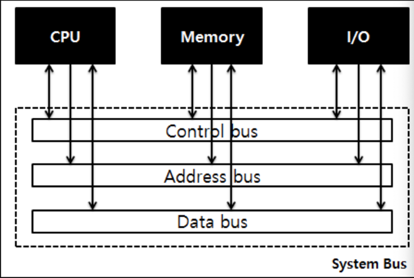

### 시스템 버스에 대해 설명해주세요.

- 데이터의 교통수단
- CPU/RAM/I.O Devieces 의 데이터를 연결해준다.
- 각 장치들이 다른 장치로 데이터를 보낼 수 있게 해준다.
- 각 장치간의 하드웨어를 물리적으로 연결해준다.
- 내부 버스와 외부 버스가 있다.

### 시스템 버스의 기본 동작
- 쓰기 동작 과정
  - 버스 사용권을 획득, 주소와 데이터 및 쓰기 신호를 전송
- 읽기 동작 과정
  - 버스 사용권을 획득, 주소와 읽기 신호를 보내고
   데이터가 전송되어 올 때 까지 대기

### 데이터 버스
- CPU와 기타 장치 사이에서 데이터를 전달하는 통로
- 기억장치와 I/O 장치의 명령어와 데이터를 CPU로 보내거나,  
연산 결과를 기억장치와 I/O로 보낸다.
- 데이터 버스의 크기 = CPU가 한 번에 전송 가능한 데이터의 크기
- 데이터를 주고 받아야 하기 때문에 양방향 버스이다.

### 주소 버스
- CPU가 주기억 장치나 I/O 장치로 기억장치 주소 / I.O Unit의 포트 번호를 전달하는 통로
- 데이터를 정확하게 전달하기 위해서는 주소를 정해주어야 함.
- 주소 버스는 CPU에서 메모리로만 주소를 전달만 하기 때문에 단방향 버스임
- 데이터 버스의 경우, CPU/Memory가 I.O Unit과 양방향으로 데이터 전달이 가능한 버스를 사용함.

### 제어 버스
- 데이터 버스와 주소 버스를 제어하기 위해 제어 신호들을 전송하는 통로
- Read와 Write 신호 전달
- 읽기 동작과 쓰기 동작을 모두 수행하기 때문에, 양방향 버스임

- 기억장치 쓰기 신호
  - 버스에 실린 데이터를 주소가 지정하는 기억장소에 저장되도록 하는 제어 신호
- 기억장치 읽기 신호
  - 주소가 지정하는 기억장소의 내용을 읽어서 버스에 실리게 하는 제어 신호
- I/O 쓰기 신호
  - 버스에 실린 데이터를 지정된 I/O 장치로 출력되게 하는 제어 신호
- I/O 읽기 신호
  - 지정된 I/O 장치로부터 데이터를 읽어서 데이터 버스에 실리게 하는 제어 신호

### 버스 대역폭
- 버스의 클럭 주파수 * 데이터 버스의 폭
- 데이터가 이동하는 버스를 통해 단위 시간당 전송하는 데이터의 크기
- 단위 시간당 전송할 수 있는 데이터의 양, 버스 클럭 주기에 의해 결정됨.
- 단위는 MB/s, GB/s

### 컴퓨터 구성 요소간 통신

1) CPU <-> 메모리
- 적재(Load)와 저장(Store) 명령에 의해 수행

<적재> : Load
- 주소 버스 : 메모리에서 불러올 데이터가 저장된 주소값을 전달 ( CPU -> Memory )
- 제어 버스 : Memory Reade 신호 전달 ( CPU -> Memory )
- 데이터 버스 : 지정한 메모리에 저장된 값을 전달 ( Memory -> CPU )

2) CPU <-> I/O Unit
- 입력(Input)과 출력(Output) 명령에 의해 수행

<입력> : Input
- 주소 버스 : 해당 입출력 장치의 포트 번호 전달 ( CPU -> I/O Unit )
- 신호 버스 : I/O Read(Input) 신호 전달 ( CPU -> I/O Unit )
- 데이터 버스 : 해당하는 I/OP Unit은 데이터를 전달해줌 ( I/O Unit -> CPU )

<출력> : Output
- 주소 버스 : 해당 입출력 장치의 포트 번호 전달 ( CPU -> I/O Unit )
- 신호 버스 : I/O Write(Output) 신호 전달 ( CPU -> I/O Unit )
- 데이터 버스 : 입출력 장치에 데이터 전달 ( CPU -> I/O Unit )

<인터럽트> : Interrupt
- 입출력장치는 제어신호를 통해 인터럽트 요청을 보내서, CPU에 입출력작업을 요청할 수 있다.
- 인터럽트 요청 : 입출력 준비를 마친 I/O Unit이 CPU에 입출력 작업의 시작 요청
- 인터럽트 확인 : CPU가 입출력 동작을 수행할 것을 입출력장치에 통보

3) 메모리 <-> I/O Unit
- 입출력 장치와 메모리의 통신은 CPU를 이용하지 않고, 직접 기억장치 엑세스 방식(DMA, Direct Memory Access )으로 통신
- DMA 제어기는 CPU를 대신해 주소 버스와 제어버스에 신호를 전달함.
- DMA 제어기는 통신 시작 전 CPU에 버스 사용에 대한 허가를 받아야 한다.

### 버스도 공유자원
- 버스 마스터 ( Bus Master )
  - 시스템 버스에 접속되는 요소들 중에서 버스 사용의 주체가 되는 요소들
    ( CPU < 기억장치 모듈, I/OI 제어기 )
- 버스 경합 ( Bus Contention )
  - 한 개의 시스템 버스에 접속된 여러 개의 버스 마스터들이 동시에 버스 사용을 요구하는 현상
- 버스 중재 ( Bus Arbitration )
  - 버스 경합 발생 시, 어떤 기준에 따라 버스 마스터들 중에서 한 개씩만 선택하여 순서대로 버스를 사용할 수 있게 해주는 동작
  - 버스 중재기(Bus Arbiter) : 버스를 중재하는 하드웨어 모듈

### I/O Controller
- 시스템 버스에서 I/O 장치에 직접 연결하지 못함
- I/O 장치 제어기를 통해 제어를 전달한다.
- 접속 경로 : CPU <-> 시스템 버스 <-> I/O Controller <-> I/O Devices

- I/O 장치 제어기 레지스터
  - 상태 레지스터
  - 데이터 레지스터로 이루어짐
  - 각각에 주소가 할당됨.
  - 즉, I/O 장치에는 기본적으로 2개의 주소가 할당됨.

- 데이터 레지스터
  - CPU <-> I/O 장치 간에 전달되는 데이터들을 일시적으로 저장
  - Data 임시 기억
- 상태 레지스터
  - I/O 장치의 현재 상태를 나타내는 비트들을 저장하는 레지스터
  - 준비 상태 ( RDY ), 데이터 전송 확인 ( ACK ) 비트 등이 존재.