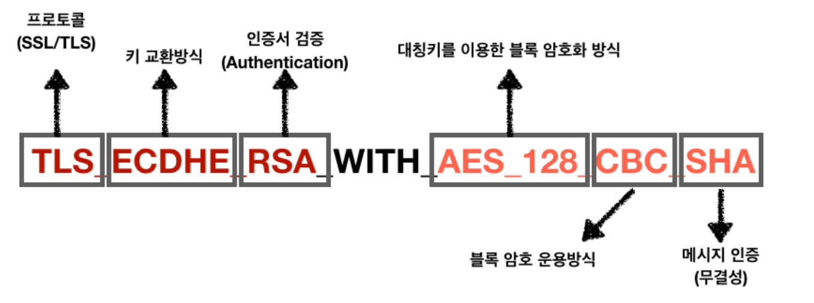

### HTTPS와 SSL Handshake 과정에 대해 설명해주세요.

### HTTPS, SSL Handshake

- HTTPS 통신 과정에서
송신자와 수신자가 암호화 통신을 하기 위한 방법과 수단에 대해 공유한다.

- 데이터를 암호화할 대칭키(비밀키)를 타인에게 노출시키지 않고,
Client가 Server에게 전송하기 위한 협상을 벌이는 것

- 이 방법이 SSL/TLS Handshake

- 협상 과정에는, SSL 인증서 전달 / 대칭키(비밀키) 전달 / 암호화 알고리즘 결정 / SSL,TLS 프로토콜 결정 등이 포함됨.

### SSL Handshake 순서
" 암호화 알고리즘(Ciper Suite) 결정 "
" 데이터를 암호화할 대칭키(비밈키) 전달 "
에 집중

1. Client Hello
- Client가 Server에 연결을 시도하며 전송하는 `패킷`

- 클라이언트가 `사용 가능한 Ciper Suite 목록`, `Session ID`, `SSL Protocol Version`, `Random Bytes` 등을 전달

- Ciper Suite는 SSL Protocol Version, 인증서 검증, 데이터 암호화 프로토콜, Hash 방식 등의 정보를 담고있는 존재로
선택된 Ciper Suite의 알고리즘에 따라 데이터를 암호화하게 됨.

2. Server Hello
- Client가 보내온 ClientHello Packet을 받아, Ciper Suite 중 하나를 선택한다음,
Client에게 이를 알림.

- 또한 자신의 SSL Protocol Version 등도 같이 보냄.

3. Certificate

- Server가 자신의 SSL 인증서를 Client에게 전달함.

- 인증서 내부에는 Server가 발행한 공개키( + 개인키는 서버가 소유 )가 들어있음.

- Client는 Server가 보낸 CA(Certificate Authority)의 개인키로 암호화된 이 SSL 인증서를
이미 모두에게 공개된 CA(Certificate Authority)의 공개키를 사용하여 복호화함.
복호화에 성공하면 이 인증서는 CA가 서면한 것이 맞는 것이니, 진짜임이 증명되는 것. ( 인증서 검증 )

- Client는 데이터 암호화에 사용할 대칭키(비밀키)를 생성한 후, SSL 인증서 내부에 들어있던 Server의 공개키로 암호화해 Server로 전송함.

4. Server Key Exchange / Server Hello Done
- Server의 공개키가 SSL 인증서 내부에 없는 경우, Server가 직접 전달함을 의미함.

- 공개키가 SSL 인증서 내부에 있는 경우, Server Key Exchange는 생략됨.

- 대칭키(비밀키, 데이터를 실제로 암호화하는 키)를 Client가 생성하여
SSL 인증서 내부에서 추출한 Server의 공개키를 이용해 암호화한 후 Server에 전달함.

- 여기서 전달된 '대칭키'가 바로 SSL Handshake의 목적이자, 가장 중요한 수단인
데이터를 실제 암호화할 대칭키(비밀키). 이제 키를 통해 Client와 Server가 교환하고자 하는 데이터를 암호화함.

5. ChangeCiperSpec / Finished
- Client, Server 모두가 서로에게 보내는 Packet으로 교환할 정보를 모두 교환한 뒤,
통신할 준비가 다 되었음을 알리는 패킷. 'Finished' Packet을 보내서 SSL Handshake를 종료한다.

