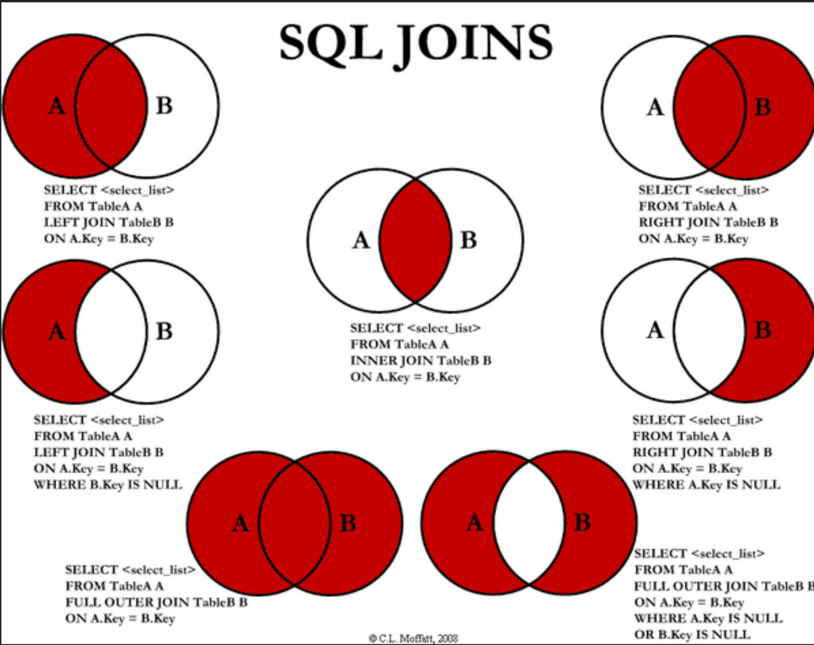

### DB의 JOIN에 대해 설명해주세요.
```
JOIN은 둘 이상의 테이블에서
테이블간 관련있는 컬럼을 기반으로
레코드를 조합하여 표현해주는 문법입니다.
```



### 조인
- 두 테이블의 조인을 위해서는 기본키(PRIMARY KEY, PK)와 외래키(FOREIGN KEY, FK) 관계로 맺어져야 하고,
이를 일대다 관계라고 한다.

- 레코드를 조합하는 방식에 따라 종류가 구분됨.
  - INNER JOIN
  - LEFT JOIN
  - RIGHT JOIN

### INNER JOIN
- INNER JOIN은 ON 절과 함께 사용되고, <br>
ON 절의 조건을 만족하는 데이터만을 가져옴.

```sql
-- INNER JOIN
SELECT <selection list>
FROM TABLE_1
(INNER) JOIN TABLE_2
ON <Predicate>
```

### LEFT JOIN
- 첫 번째 테이블을 기준으로, 두번째 테이블을 조합하는 JOIN

- ON 절의 조건을 만족하지 않는 경우, 첫 번째 테이블의 필드 값은 그대로 가져옴.

- 하지만, 해당 레코드의 두 번째 테이블의 필드 값은 모두 `NULL` 로 표시됨.

```sql
SELECT <selection list>
FROM TABLE_1
LEFT JOIN TABLE_2
ON <Predicate>
```

#### LEFT JOIN 을 여러번 할 때 주의점
- INNER JOIN과는 달리 LEFT JOIN은 조인하는 테이블의 순서가 매우 중요하다.

- 어떤 순서로 테이블을 조인하는지에 따라 결과 테이블에 조회되는 행의 개수와 구성이 달라질 수 있다.

- LEFT JOIN을 할 거라면, <br>
가장 첫번째 테이블로 SELECT 문에 가장 많은 열을 가져와야할 테이블을 우선으로 적어준다.

- 조인을 여러 번 해야하는데 시작을 LEFT JOIN으로 했다면 <br>
나머지 조인도 LEFT JOIN을 이어나간다.


### RIGHT JOIN
- 두번째 테이블을 기준으로, 첫번째 테이블을 조합하는 JOIN

- ON 절의 조건을 만족하지 않는 경우에는 두 번째 테이블의 필드 값은 그대로 가져옴.

- 해당 레코드의 첫번째 테이블의 필드 값은 모두 `NULL`로 표시

### 3중 조인
- 만일 원하는 정보가 테이블 3개로 흩어져있을 때, <br>
이 세개의 테이블을 모아야 할 떄, Outer Join을 연속으로 3번 사용하면 됨.

```sql
-- 3개의 테이블을 join하고 한국에대한 정보만 뷰로 생성해라
create view allView as 
( 
    select A.Name, A.CountryCode 
    from city A 
    left join country B 
    on A.countrycode = B.code -- 테이블 2개 조인 완료
    left join countrylanguage C 
    on B.code = C.countrycode -- 테이블 3개 조인 완료
    where A.countrycode in ('KOR'); 
)
```


### Exclusive Left Join
- 어느 특정 테이블에 있는 레코드만 가져오는 것

- 기존의 LEFT JOIN과 Where 조건을 함께 사용하여 만드는 JOIN 문법

```sql
SELECT * 
FROM table1 A LEFT JOIN table2 B
ON A.ID_SEQ = B.ID_SEQ 
WHERE B.ID_SEQ IS NULL -- 조인한 B 테이블의 값이 null만 출력하라는 말은, 조인이 안된 A 레코드 나머지값만 출력하라는 말
```

### Self Join
- 테이블 자기 자신을 조인한 것

```sql
-- 예) 모든 사원에 대해 사원의 이름과 직속 상사의 이름을 검색 해라.
-- EMPNAME 테이블에 어떤 사원의 MANAGER 번호가 같은 테이블 내에서 어떤 사원의 EMPNO와 같으면 그 사원이 직속 상관

SELECT E.EMPNAME as 사원, M.EMPNAME as 직속상관
FROM EMPLOYEE E, EMPLOYEE M -- inner join
WHERE E.MANAGER = M.EMPNO;
```

### JOIN에서 중복된 레코드 제거
-> JOIN을 하면, 레코드의 쌍을 만들 일이 많아지는데, 이것이 부하가 될 수 있다.

1) `DISTINCT` 사용
- 문법이 간단하다.
- 레코드 수가 많은 경우 성능이 느리다.
```sql
 -- DISTINCT를 추가
 SELECT DISTINCT person.id, person.name, job.job_name 
 FROM person INNER JOIN job 
 ON person.name = job.person_name;
```

2) JOIN 전에 중복을 제거하기
- SELECT DISTINCT는 간단하지만 성능이 느리다.

- 성능을 위해서, `JOIN 전에 중복을 제거하는 작업을 해주는 것`이 좋다.

```sql
select A.name, A.countryCode 
from city A 
left join ( select distinct name, Code from country ) as B 
-- 조인할 테이블에 먼저 distinct로 중복을 제거한 select문을 서브쿼리로 불러와 임시테이블로 만든뒤 조인한다
on A.countrycode = B.Code
```


### DISTINCT
1. 기본 사용법
```sql
-- tCity 테이블에서 region컬럼에 대해 중복 제거하여 출력
SELECT DISTINCT region FROM tCity;
```

2. DISTINCT 키워드 뒤에 2개 이상 컬럼 사용
- DISTINCT 뒤에 2개 이상의 컬럼을 사용하면, <br>
DISTINCT 뒤에 오는 모든 컬럼에 대해 하나의 행으로 인식하여, <br>
그 행의 중복을 제거함.

```sql
-- tCity 테이블에서 region, name 컬럼 합쳐서 중복인 행을 제거합니다.
SELECT DISTINCT region, name FROM tCity;
```

참고 : https://bio-info.tistory.com/110