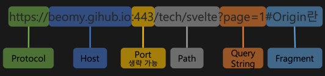
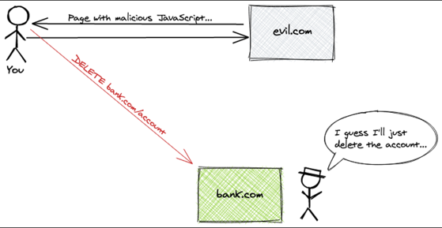
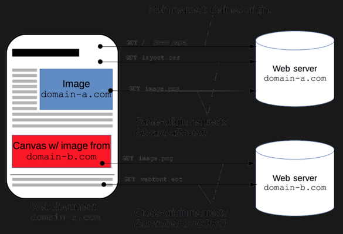
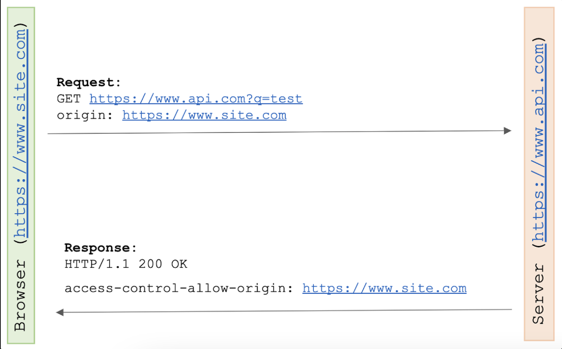
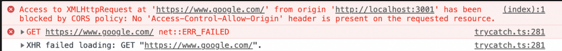
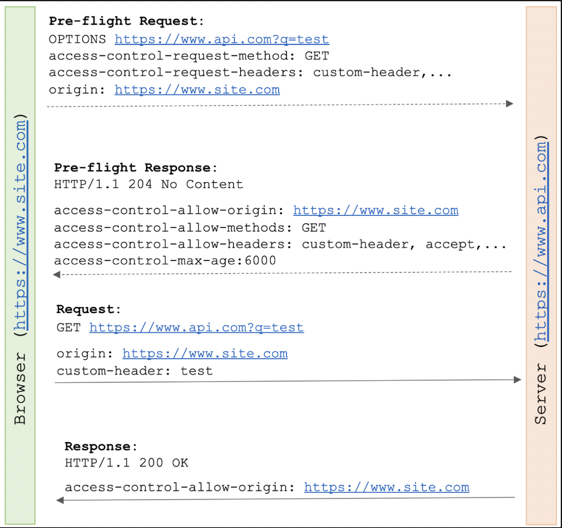
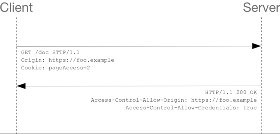
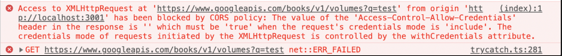

# CORS 에 대해 설명해주세요.

### CORS ( Cross-Origin Resource Sharing )

- 출처가 다른 자원들을 공유한다.
- 한 출처에 있는 자원에서 다른 출처에 있는 자원에 접근하도록 하는 개념
- 추가 HTTP Header를 사용하여, 한 출처에서 실행 중인 웹 어플리케이션이 다른 출처의 선택한 자원에 접근할 수 있는 권한을 부여하도록 브라우저에 알려주는 체제.
- 웹 어플리케이션은 리소스가 자신의 출처(도메인, 프로토콜, 포트)와 다를 때, 교차 출처 HTTP 요청을 실행함.

### 출처



- **`Protocol + Host + Port`**가 같으면 **동일 출처(Origin)**라고 한다.

### 동일 출처 vs 다른 출처 예시

1) [**http://example.com:80**](http://example.com:80) vs **http://example.com**

- 프로토콜 : http
- 호스트 : example.com
- 포트 : 80, 80 ( HTTP 기본 포트가 80인데, 생략됨 )

→ 동일 출처

2) http://example.com/app1/index.html
   vs http://example.com/app2/index.html

- 프로토콜 : http
- 호스트 : example.com
- 포트 : 80, 80

→ 동일 출처

3) http://example.com/app1

vs https:/example.com/app2

- 프로토콜 : http vs https
- 호스트 : example.com
- 포트 : 80 vs 443

→ 다른 출처

4) http://example.com

vs http://www.example.com

vs http://myapp.example.com

- 프로토콜 : http
- 호스트 : [example.com](http://example.com) / [www.example.com](http://www.example.com) / myapp.example.com
- 포트 : 80

→ 다른 출처

5) http://example.com

vs http://example.com:8080

- 프로토콜 : http
- 호스트 : example.com
- 포트 : 80 vs 8080

→ 다른 출처

**다른 출처 요청일 경우**,
**CORS 정책에 준수하여 요청해야만
정상적으로 응답을 받을 수 있다.**

### 다른 출처에 대한 요청의 위험성
- ``, `<script>`, `<frame>`, `<video>`, `<audio>` 와 같은 태그가 웹에
  등장하면서 페이지 로딩 이후,
  브라우저에서 이러한 하위 자원들을 가져올 수 있게 되었다.
- 그러므로 동일 출처, 다른 출처 모두 호출이 가능하게 됨.



- 웹 브라우저를 통해 웹 서핑 중,
  [evil.com](http://evil.com) 을 실행했는데, 그 페이지를 통해 다운받은 script파일에서
  은행 서버에 Ajax 요청으로 은행 API 중 하나인, ”Delete /account” 요청을 할 수 있게 된다면?
- 만약, CORS 정책이 적용되지 않은 웹 브라우저라면,
  그대로 은행 계좌를 삭제하는 사고가 난다.

### 동일 출처 정책(Same-Origin Policy)

- 다른 출처로부터 조회된 자원들의 읽기 접근을 막아
  다른 출처 공격을 예방한다.
- 다른 출처에서 얻은 이미지를 담는 `<`img>`,
  외부 주소를 담는 `<link>`와 같은 여러 태그들은 허용한다.
- 동일 출처 정책의 정확한 구현 명세는 없지만,
  최신 브라우저들은 `RFC6454` 와 같은 일정 규칙을 따르고 있음.

→ **동일 출처 정책**은
다른 출처의 자원을 가져오는 것을 굉장히 제한적으로 허용함.

**SPA( Single Page Application** ; 단일 페이지 어플리케이션, 서버에서 필요한 데이터만 비동기로 받아와서 동적으로 현재 화면에 다시 렌더링하는 어플리케이션 ) 와
**미디어 중심 웹 사이트**들이 더욱 늘어나서, 관련 규칙이 자꾸 늘어나는 문제가 있다.

→ 다른 출처 리소스에 대한 접근성을 높이기 위해

**CORS**가 등장함.

### 동일 출처 요청  vs 다른 출처 요청

- 요청하는 클라이언트와 요청받는 서버가
  **같은 출처에 있으면 동일 출처**,
  **서로 다른 서버에 있으면 다른 출처 요청**



- 왼쪽 모바일 기기의 현재 URL은 [domain-a.com](http://domain-a.com) 이다.
- 오른쪽 서버의 URL은 [domain-a.com](http://domain-a.com) , [domain-b.com](http://domain-b.com) 이 2가지.

1. [domain-a.com](http://domain-a.com) 의 유저가 domain-a.com 서버에 요청하면, 동일 정책이기 떄문에 아무런 문제가 없다.
2. [domain-a.com](http://domain-a.com) 의 유저가 [domain-b.com](http://domain-b.com) 서버에 요청하면
   프로토콜/호스트/포트 중 호스트가 다르기에, 다른 출처 요청을 하게 됨.
3. 도메인 이외에,
   같은 프로젝트 내에서 정의된 css파일에 대한 요청은 동일 출처 요청,
   font같은 경우, 다른 외부 사이트에서 실시간 import를 통해 가져온다면 다른 출처 요청.
4. 즉, 예상치 못하게 같은 출처가 아닌 외부에 자원을 요청하는 경우가 있을 수 있다.

**`동일 출처 정책(Same-Origin Policy)`**는

기본적으로 동일 출처 요청만 자유롭게 요청이 가능하다.

하지만, 다른 출처의 자원이 필요한 경우는 자주 있고, 늘어나는 추세다. ( SAP, 미디어 기반 웹서비스 )

이에 대한 기준을 완화하여

다른 출처 요청도 할 수 있도록 기준을 만든 체제가

**`다른 출처 정책 (Cross-Origin Policy)`**이다.

### 다른 출처 정책 3가지 ( CORS 정책 3가지 )

- 단순요청( Simple Request )
- 프리플라이트 요청 ( Preflighted Request )
- 인증정보요청 ( Credential Request )

### 단순요청 ( Simple Request )

- HTTP 요청에 대한 제약
    - GET, HEAD, POST 요청만 가능하게 한다.
- HTTP 헤더에 대한 제약
    - Accept, Accept: Language, Content : Language, Content-Type 과 같은 CORS 안전 리스트 헤더 혹은 User-Agent 헤더,
      Content-Type 헤더는 application/x-www-form-urlencoded, multipart/form-data , text/plain만 가능하다. ( ReadableStream 객체가 사용되지 않음 )
- XMLHttpRequest 객체를 사용하여 요청하면,
  요청에 사용된 XMLHttpRequest.upload에 의해 반환되는 객체에 대한
  어떠한 이벤트 리스너도 등록되지 않음.

```javascript
const xhr = new XMLHttpRequest();
const url = 'https://www.api.com?q=test';
xhr.open('GET', url);
xhr.onreadystatechange = requestHandler;
xhr.send();
```



- 브라우저는 다른 출처에 자신의 주소 https://www.site.com 을 origin에 담아서 요청을 보낸다.
- 서버는 요청을 확인하고, 다른 출처 주소 https://www.site/com 에 접근이 가능하다는
  access-control-allow-origin에 해당 주소를 담아서 결과를 리턴함.
- access-control-allow-origin 은, CORS 관련 헤더의 중요 요소 중 하나로
  어떤 출처로부터 오는 요청을 허용할지 결정함.
    - 이 헤더 값은 하나의 출처가 될 수도, “*”를 사용해 어떤 출처도 허용하도록 할 수 있음.
- 만약, 서버가 이 헤더에 대해 응답하지 않거나,
  헤더 값이 요청의 출처와 일치하지 않는 도메인으로 설정되어 있는 경우,
  **요청한 출처가 서버의 access-control-allow-origin에 포함되어 있는 경우 (←왜?)**
  브라우저는 응답을 차단함.



### 프리 플라이트 요청 ( Preflight Request )

- 프리 플라이트 : 실제 요청 전에 브라우저에서 보내는 작은 요청
- 프론트엔드에서 백엔드 쪽으로 요청을 보낸 이후에만 허용된 Origin인지 아닌지를 알 수 있는 상황이어서 문제가 발생.
- 지금 요청을 보내는 프론트앤드가 백앤드 서버에서 허용한 Origin이 맞는지,
  해당 엔드포인트에서 어떤 HTTP 메소드들을 허용하는지 등을 확인한다. ( 실제 요청이 전송하기에 안전한지 확인 )
    - 만약, 허용되는 Origin이고, 요청하는 메소드도 허용되는 것이라면 실제 요청을 할 수 있게 해줌.
    - 그렇지 않다면, 요청을 보내기도 전에 보내지 못하게 막는다.
- 다른 출처 요청이 유저 데이터에 영향을 줄 수 있기에,
  미리 전송해서 알아본다는 의미이다.

**< Preflight 요청 헤더 >**

- origin : 어디서 요청을 했는지 서버에 알려주는 주소
- access-control-request-method : 실제 요청이 보낼 HTTP Method
- access-control-request-headers : 실제 요청에 포함될 헤더

**< Preflight 응답 헤더 >**

- access-control-allow-origin : 서버가 허용하는 출처
- access-control-allow-methods : 서버가 허용하는 HTTP 메서드 리스트
- access-control-allow-headers : 서버가 허용하는 header 리스트
- access-control-max-age : 프리 플라이트 요청의 응답을 캐시에 저장하는 시간



- HTTP Method - OPTIONS 을 사용해 자신의 주소 https://www.api/com?q=test 를 보낸다.
  또한 HTTP Header로 origin, access-control-request-method, access-control-request-headers를 같이 보냄.
- 정상적인 응답으로, access-control-allow-origin, access-control-allow-method, access-control-allow-headers, access-control-max-age를 응답받음.
- 정상 요청 및 응답이 가능하다는 것을 프리플라이트 요청을 알게된 후,
  실제 요청을 한 뒤 정상적인 응답을 받음.

```jsx
// Client ( Broweser ) : Preflight Request
const xhr = new XMLHttpRequest();
const url = 'https://www.api.com?q=test';
xhr.open('GET', url);
xhr.setRequestHeader('custom-header', 'test');
xhr.onreadystatechange = requestHandler;
xhr.send();
```

### 신용 요청 ( Credentialed Request )

- 쿠키, 인증 헤더, TLS 클라이언트 인증서 등의 신용정보와 함께 요청한다.
- 기본적으로 CORS 정책은 다른 출처 요청에 대해 인증정보 포함을 허용하지 않음.
- 요청에 인증을 포함하는 플래그가 있거나,
  access-control-allow-credentials가 true로 설정된다면 요청 가능

```javascript
const xhr = new XMLHttpRequest();
const url = 'https://www.api.com?q=test'
xhr.open('GET', url);
xhr.withCredentials = true;
xhr.send();
```

만약, 서버 응답에 access-control-allow-credentials가 true로 설정되어있지 않거나,
access-control-allow-origin 헤더에 있는 값이 허용된 출처가 아니면, 오류가 발생함.



### CORS 중 어떤 요청 방식이 권장되는가?

- PreFlight 요청을 사용하는게 좋다.
- 실제 요청이 실행되기 이전에 검사를 하고 허용할지 안할지를 결정할 수 있기 때문이다.

### Spring Boot에서 Cross-Origin 설정

- 메서드 설정, 컨트롤러 설정이 있다.
- 개별적으로 적용할 수도 있음.

### 메서드에 CrossOrigin 설정

```java
@RestController
@RequestMapping("/account")
public class AccountController {

		@CrossOrigin
		@RequestMapping(method = RequestMethod.GET, path = "/{id}")
		public Account retrieve(@PathVariable Long id){
				// ...
		}

		@RequestMapping(method = RequestMethod.DELETE, path = "/{id}")
		public void remove(@PathVariable Long id){
				// ...
		}
}
```

- retrieve() 메서드에 선언된 @CrossOrigin 의 Default설정
    - 1) 모든 출처가 허용됨 ( access-control-allow-origin : “*” )
    - 2) 허용된 HTTP Method는 @RequestMapping에 선언된 메서드들
    - 3) Preflight 응답은 30분 동안 캐시됨.

### 컨트롤러에 CrossOrigin 설정

```java
@CrossOrigin(origins = "http://example.com", maxAge = 3600)
@RestController
@RequestMapping("/account")
public class AccountController {

		@RequestMapping(method = RequestMethod.GET, path = "/{id}")
		public Account retrieve(@PathVariable Long id){
				// ..
		}

		@RequestMapping(method = RequestMethod.DELETE, path = "/{id}")
		public void remove(@PathVariable Long id){
				// 
		}
}
```

- 컨트롤러에 설정하였으므로, AccountController에 있는 `**retrieve()**`와 `**remove()**` 메서드 모두에 적용됨.

### 개별 적용하기

```java
@CrossOrigin(maxAge = 3600)
@RestController
@RequestMapping("/account")
public class AccountController {

		@CrossOrigin("http://example.com")
		@REquestMapping(method = RequestMethod.GET, "/{id}")
		public Account retrieve(@PathVariable Long id){
				// ...
		}

		@RequestMapping(method = RequestMethod.DELETE, path = "/{id}")
		public void remove(@PathVariable Long id){
				// ...
		}
}
```

- 메서드의 결과가 3600초동안 캐시된다.
- retrieve() 메서드는 허용 출처가 “http://example.com” 만으로 한정됨.
- remove() 메서드는 별도의 설정이 없으므로 모든 출처에서 요청이 가능하다.
- 이와 같이, 스프링에서 여러가지 CORS 정책을 복합하여 설정할 수 있다.

### 전역 CORS 설정

- CORS 정책의 설정은 WebMvcConfigurer을 구현하여 설정할 수 있음.
- 이는 Filter 기반이기에, 전역적으로 모든 요청에 대해 검사한다.

```java
@Configuration
@EnableWebMvc
public class WebConfig implements WebMvcConfigurer {

		@Override
		public void addCorsMappings(CorsRegistry registry){
				registry.addMapping("/**");
		}
}
```

[https://bskyvision.com/entry/CORS와-관련-있는-preflight-request란](https://bskyvision.com/entry/CORS%EC%99%80-%EA%B4%80%EB%A0%A8-%EC%9E%88%EB%8A%94-preflight-request%EB%9E%80)