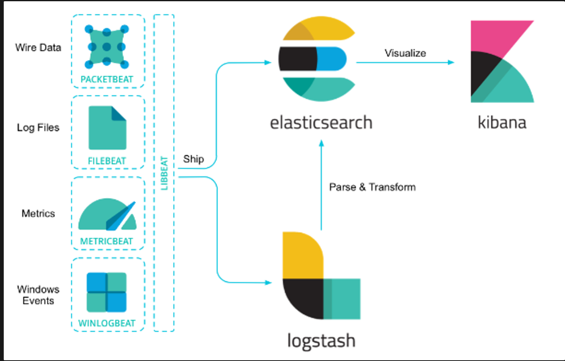

### ElasticSearch에 대해 간단히 설명해주세요.

- Apache 루씬을 기반으로한
  text, 숫자, 위치 기반 정보, 정형 및 비정형 데이터 등
  모든 유형의 데이터를 위한 **무료 검색 및 분석 엔진**
- 텍스트 분석에 특화됨. 웹 검색 엔진에서 주로 사용된다.
- 데이터 수집 / 보강 / 저장 / 분석 / 시각화를 위한 무료 개방형 도구 모음인
  ELK 스택 ( ElasticSearch, Logstash, Kibana ) 중 분석과 저장을 담당.

- ElasticSearch가 사용되는 분야
    - **어플리케이션 검색**
    - 로깅, 로그 분석
    - Infra Metric, Container Monitoring
    - 어플리케이션 성능 모니터링
    - 위치 기반 정보 데이터 분석 & 시각화
    - 보안 분석
    - 비즈니스 분석

### ElasticSearch의 인덱스 구조와 RDBMS의 인덱스 구조의 차이에 대해 설명해주세요.

- 문서 저장
    - ElasticSearch에 Index ( ≠ RDBMS 인덱스 )라 부르는 DB에
      문서를 저장하면, 메타데이터 ( 문서의 내부 식별자, 버전 등 ) & 소스 데이터(문자열)을
      Key-Value 형태의 JSON으로 변형하여 저장함.
    - 저장한 각 문서를 Document라 부름.
      _doc API를 통해 단일 데이터의 CRUD 진행 가능
    - **유의어, 동의어, 전문검색**을 하기 위해 Text 형태의 데이터를 받아 **`형태소 분할`**을 함.
    - 단어 단위로 자르고, ‘조사’를 삭제
      ⇒ 문서별로 의미있는 데이터만 추출 가능,
      이것을 기반으로 특정 검색어에 대해 유사도 점수를 부여하여
      검색한 것과 가 가까운 문서를 찾을 수 있음.
- 단순 Text 형태의 메시지를 Tokenizer, Filter 혹은 Analyzer을 통해 분할하여 저장한다.
- _analyze API를 활용한다.

### ElasticSearch의 키워드 검색과 RDBMS의 LIKE 검색의 차이에대해 설명해주세요.

- RDBMS 기반의 어플리케이션은 텍스트 검색이 어려움.
- LIKE 검색에 의존하지만,
  LIKE 검색은 **동의어나 유의어에 대해서 지원해주지 않음.**
- ElasticSearch는 여러 특징을 통해,
  문자열에 대한 **동의 / 유의 / 전문검색 등을 지원함**.

- 전문 검색 ( Full Text Search )
    - 내용 전체를 색인, 특정 단어가 포함된 문서를 검색 가능
- 스키마리스
    - 미리 정의된 스키마가 없어도, 데이터를 스스로 분석하여 필드를 생성하고 저장
- RESTful API
    - GET, POST, DELETE 등의 REST API를 통해 데이터를 CRUD 할 수 있음.
- 역색인 구조 ( Inverted Index )
    - 색인되어 있는 데이터에 대해 문서 페이지에 대한 링크 제공

https://sihyung92.oopy.io/database/elasticsearch/1