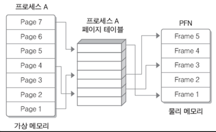
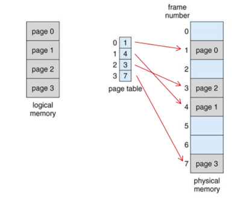
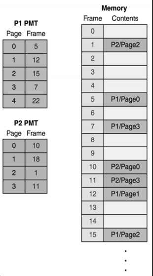
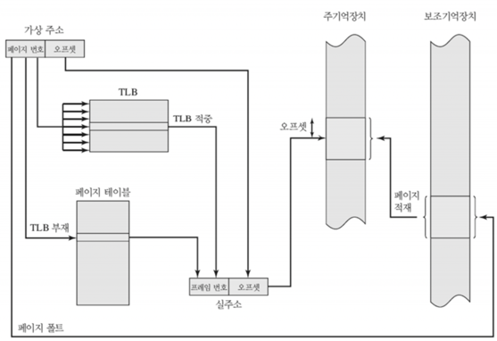
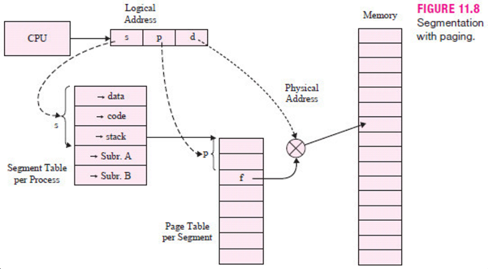

# 가상메모리에 대해 설명해주세요.

### 메모리

- 프로그램과 프로그램의 수행에 필요한 데이터 및 코드를 저장하는 장치
- 내부 기억장치인 주기억장치, 외부 기억장치인 보조 기억장치로 분류됨.

### 내부 기억장치

- Register
- Cache Memory
- DRAM

### 외부 기억장치

- SSD
- HDD

### 가상 메모리 등장 배경

- 초창기 컴퓨터에서는 사용 가능한 RAM의 용량이
  가장 큰 실행 Application의 주소 공간보다 커야했다.
    - 이렇지 않은 경우, 메모리 부족 오류에 의해 해당 어플리케이션을 실행할 수 없었음.
- 오버레이 기법
    - 어플리케이션의 일부분만 기억장치에 올려 실행하도록 지정하는 방법
    - 완전히 메모리 부족문제를 해결하지는 못함.
        - 시스템이 프로그램을 위한 충분한 메모리를 갖추고 있지 않은 경우, 결국 똑같은 메모리 부족 오류가 발생함.
- 가상 메모리 기법
    - 어플리케이션을 실행하는 데에 얼마나 많은 메모리가 필요한지에 집중하는 것이 아닌,
      어플리케이션을 실행하는 데 최소한의 얼마만큼의 메모리가 필요한가에 집중하여 문제 해결
    - 메모리에 올라가지 않는 어플리케이션의 나머지는, 보조 기억장치, 디스크의 SWAP 영역에 존재한다.
    - 가상 메모리의 핵심은 보조 기억장치

### 가상 메모리 ( Virtual Memory )

- 메모리가 실제 메모리보다 많아 보이게 하는 기술
- 어떤 프로세스가 실행될 때, 메모리에 해당 프로세스 전체가 올라가지 않아도, 실행 가능하다는 점에 착안하여 고안됨.
- 프로세스 실행 시, 실행에 필요한 일부분만 메모리에 올라감.
  어플리케이션의 나머지 부분 → 디스크에 남음.
    - 디스크 ( 정확히는 **Disk의 Swap 영역** ) RAM의 보조 기억장치처럼 동작
- RAM + SSD/HDD 를 하나의 메모리로 가상화하여 바라보는 것
- 이를 지원하기 위한 하드웨어가 존재한다. **`MMU ( Memory Management Unit )`**
- 이를 통해, 메모리에 대해 어플리케이션이 신경쓰지 않아도 된다.
  = 어플리케이션의 메모리에 대한 종속성이 제거된다.
    - 메모리와 어플리케이션 사이에서 OS가 중재자 역할을 해준다.
        - 프로세스가 죽었을 때, 메모리 회수 ( **자원 관리** ) /
          프로세스가 다른 프로세스의 메모리 영역 침범 등 잘못된 접근을 하였을 때 메모리 상태 제어 ( 보안 ) : 페이지 테이블에 rwx 비트 두어 관리하기 /
          프로세스 간의 가상 메모리 주소공간 ( VMS )가 동일한 물리 메모리 주소를 가리키게 하는 등의 방법으로 IPC의 Shared Memory 구현 등의 일이 가능해짐.

### MMU ( Memory Management Unit )

<역할>

- **가상 주소를 물리주소로 변환**
- **메모리를 보호한다.**

**<Paging>**

- 메모리를 일일이 가상 주소 → 물리적 주소로 번역하면
  작업 부하가 너무 크므로,
  MMU는 RAM을 여러 페이지로 나누어 각 페이지를 하나의 독립된 항목으로 처리한다.
- OS는 1Byte 당 주소 하나를 붙인다.
- 페이지는 보통 4KB ( = 4096 Bytes ) 의 크기를 가진다
- 페이지 기억, 주소 번역 정보를 기억하는 작업이
  가상 메모리를 구현하는 데 결정적임.

### 요구 페이징 ( Demand Paging )

- CPU가 요청할 때, 프로세스의 데이터를 메모리에 올리는 것
- 처음부터 모든 데이터를 메모리로 적재하지 않는다.

### 페이지 폴트 ( Page Fault )

- 어떤 페이지에 접근하려 했을 때, 헤당 페이지가 RAM에 부재할 때 발생하는 Interrupt
- Page Fault 발생 시, OS가 이를 해결하고, 다시 동일한 명령을 수행한다.
    - Page Fault 가 자주 발생하면, 운영체제의 성능이 많이 저하되기에
      Page Fault 횟수를 줄이는 것이 중요하다.
    - 여러가지 페이지 교체 정책( Page Replacement Policy ) 이 존재한다.
        - 메모리가 꽉 차있을 때, 기존 페이지 중 하나를 물리 메모리에서 저장 매체로 내리고, 새로운 페이지를 방금 비워진 ( = 희생된 ) 물리 메모리 공간에 올린다.
            - 이 때, 기존 페이지 중 어떤 것을 내리면 좋을지에 대한 알고리즘이 페이지 교체 알고리즘.
        - LRU, LFU .. 등의 정책이 있다.

### Swapping ( Swap-In & Swap-Out )

- Page Fault 발생 시, 페이지 교체 정책을 따라 희생자 페이지를 선택하여 디스크의 SWAP 영역으로 보내고 **( SWAP-OUT )**, Demand된 Application의 페이지를 디스크의 SWAP 영역에서 **SWAP-IN** 해온다.

### TLB ( Translation Lookaside Buffer, 페이지 정보 캐시 )

- MMU에 포함된 작은 캐시 ( 일종의 주소 변환 캐시 )
- **가상 메모리 주소를 물리적 주소로 변환하는 속도를 높이기 위해** 사용하는 캐시
- 최근 일어난 가상 메모리, 물리 주소의 변환 테이블을 저장한다.
- CPU가 가상 주소를 가지고 메모리에 접근하려할 때,
  우선 TLB에 접근하여 가상 주소에 해당하는 물리 주소를 찾고, (1)
  없다면 ( TLB Cache Miss ),
  MMU가 해당되는 물리 주소로 변환한 후 메모리에 접근한다. (2)

### 메모리 관리 기법 ( With or WIthout 가상 메모리 )

- 연속 메모리 관리 기법
    - 프로그램 전체가 하나의 커다란 공간에 연속적으로 할당된다.
        - 고정 분할 기법 : 주 기억 장치를 고정된 파티션으로 분할 → 내부 단편화
        - 동적 분할 기법 : 파티션들이 동적 생성되어, 자신의 크기와 같은 파티션에 적재 → 외부 단편화
- 불연속 메모리 관리 기법
    - 페이징
    - 세그멘테이션

### 단편화 ( Fragmentation )

- 기억 장치의 빈 공간 또는 자료가 여러 조각으로 나뉘는 현상
- 프로세스들이 메모리에 적재되고 제거되는 일이 반복되다보면,
  프로세스들이 차지하고 있는 메모리 틈 사이에 **‘사용하지는 못하지만 남아있는’** 자유 공간이 늘어난다.

### 내부 단편화

- 프로세스가 사용하는 메모리 공간 ‘내부에서’ 남는 부분
- 프로세스가 요청한 양보다 더 많은 메모리를 할당할 때 발생한다.
  OS가 할당해준 메모리의 양 - 프로세스가 필요로 하는 메모리의 양 만큼 메모리가 단편화 되었다 한다.

### 외부 단편화

- 메모리 공간 중 사용하지 못하게 되는 부분
- 메모리 할당 및 해제 작업의 반복으로 작은 메모리가 중간 중간에 존재할 있다.
  이렇게 사용하지 않는 메모리가 존재하여, 총 메모리 양은 충분해도 실제로 특정 프로세스를 할당하지 못할 수 있다.
- 외부 단편화를 해결하기 위해 **Compaction**을 사용하여 프로세스가 사용하는 공간을 한쪽으로 몰 수 있지만, 작업 효율이 좋지 못하다.

### 불연속 메모리 관리 기법

- 프로그램의 일부가 서로 다른 주소 공간에 할당될 수 있는 기법
- 단편화 문제를 해결하기 위해 제시된 기법
- **외부 단편화 해소 → 페이징**
- **내부 단편화 해소 → 세그맨테이션**

### Paging

- 프로세스를 일정한 크기의 페이지로 분할하여 메모리에 적재하는 방식
    - 페이지 : 가상 메모리 내 고정 사이즈의 프로세스 조각
    - 프레임 : 페이지 크기와 같은 주기억 장치의 메모리 조각

### Paging Table ( = Page Mapping Table ; PMT )

- OS가 관리하는 일종의 논리주소 - 물리주소 매핑 자료구조 ( 보통 배열로 구현 )
- 물리 메모리는 고정 크기의 프레임,
  가상 메모리는 고정 크기의 페이지로 분리됨.
- 개별 페이지는 순서에 상관 없이, 물리 메모리에 있는 프레임에 매핑되어 저장된다.
- 모든 프로세스는 하나의 페이징 테이블 ( 32bit OS 기분 2^32bytes 의 주소공간 ~= 4GB )을 가지고 있으며, 여기엔 메인 메모리에 적재되어 있는 페이지 번호 ( **Page Number** ) & 해당 페이지가 위치한 메인 메모리의 시작 주소 ( **Offset** )가 있다.
- 이를 통해, 하나의 프로세스를 나눈 가상 메모리 페이지들이 각각 실제 메인 메모리의 어디 프레임에 적재되어 있는지 알 수 있다.

### 논리 주소 & Paging Table

- **MMU ( Memory Management Unit )**는 가상 주소 ( 논리 주소 )를 이용해 실제 데이터가 담겨있는 주소로 변환해준다.
- 16비트의 논리주소 기준,
  6비트는 페이지 번호 / 10비트는 오프셋을 나타낸다.
- **논리 주소 ( 가상 주소 )는 <page, offset> 과 같은 형태로 구성**된다. 이를 이용해 물리 주소로 변환한다.

### 가상 주소를 물리 주소로 변환하는 전체 과정

- 1) CPU가 MMU에게 프로세스의 논리 주소 ( 페이지, 오프셋 )을 통해 물리 주소로 변환해달라 요청한다. ( On-Demand Paging )
- 2) MMU는 논리주소-물리주소가 매핑되어있는 TLB 캐시를 확인한다.
- 3) TLB에 (논리 주소 : 페이지 - 물리 주소 : 프레임 ) 매핑 자료가 없으면,
     RAM의 Page Table을 찾는다.
- 4) Page Table에서 해당 페이지가 valid 상태이고, Frame 번호와 매핑되어 있으면 이를 활용해 프레임 번호 & 가상 주소의 Offset을 가져와 실제 주기억장치 프레임 내 찾고자 하는 메모리 주소를 찾는다.
- 5) Page Table에서 해당 페이지가 invalid 상태이면 ( = SWAP-OUT ), Page Fault 인터럽트를 발생시키고, 희생자 페이지 선택 후 ( By. 페이지 교체 정책 ),  Disk ( HDD / SSD )에서 해당 Page를 찾아 SWAP-IN 해준다. ( = Disk I/O 발생 )

### 페이징의 장단점

- 장점
    - 논리 메모리는 물리 메모리에 저장될 때 연속되어 저장될 필요가 없다.
        - 물리 메모리의 남는 프레임에 적절히 배치되기 때문에 외부 단편화가 발생하지 않음.
- 단점
    - 페이지 단위로 분할하여 프로세스를 쪼개서 할당하기에,
      내부 단편화 문제가 발생 가능
    - 페이지 단위를 더 작게 하면 해결 가능하지만, 페이지 매핑 과정이 복잡해진다.
      효율이 안좋아짐.

### 세그멘테이션 (Segmentation)

- 가상 메모리를 서로 크기가 다른 논리적 단위로 분할한 것
- 프로세스를 물리적 단위인 페이지가 아닌, 논리적 단위 ( = 의미가 같은 )인 세그먼트로 분할해서 메모리에 적재하는 방식
- 프로세스를 코드/데이터/힙/스택으로 나누는 것도 세그멘테이션 방식으로 메모리를 분할하는 것이다.

### 세그먼트 테이블 ( Segment Table )

- 메모리 분할 방식을 제외하면,
  페이징과 세그멘테이션이 동일하기 때문에 매핑 테이블의 동작 방식도 동일하다.
- 다만, 논리 주소의 앞 비트들은 페이징 번호가 아닌, 세그먼트 번호가 된다.
- **<segment, offset>** 형태로 구성된다.
- 세그먼트 번호를 통해 세그먼트의 Base ( 세그먼트의 시작 물리 주소 )를 찾고, 한계 ( 세그먼트의 길이)를 파악할 수 있다. 세그먼트의 시작 물리 주소에서 Offset만큼 떨어진, 가상 주소의 실제 물리 주소를 파악할 수 있다.

### 세그멘테이션의 장단점

- 장점
    - 내부 단편화 문제가 해소됨.
    - 보호와 공유 기능 수행 가능
        - 프로그램의 중요한 부분, 중요하지 않은 부분을 분리하여 저장 가능
        - 같은 코드 영역은 한 번에 저장 간으
- 단점
    - 외부 단편화 문제가 생길 수 있음.

### 페이징 & 세그멘테이션

< 단순 페이지 >

- 각 프로세스는 프레임과 같은 길이를 가진 균등 페이지로 나뉜다.
- 외부 단편화가 발생하지 않음.
- 내부 단편화 존재 가능

< 단순 세그멘테이션 >

- 각 프로세스는 여러 세그먼트로 나뉜다.
- 내부 단편화가 생기지 않는다.
- 메모리 효율을 개선한다.
- 동적 분할을 통한 오버헤드가 감소한다.
- 외부 단편화가 존재할 수 있다.

< 가상 메모리 + 페이징 >

- 프로세스 페이지 전부를 메모리에 로드할 필요가 없다.
- CPU가 필요한 페이지가 있는 경우 나중에 자동으로 불러 들인다.
- 외부 단편화가 생기지 않음.
- 복잡한 메모리 관리로 오버헤드 발생 가능

< 가상 메모리 + 세그멘테이션 >

- 필요하지 않은 세그먼트는 메모리에 로드되지 않음.
- CPU가 필요한 세그먼트가 있을 때 나중에 불러들인다.
- 내부 단편화가 생기지 않음
- 복잡한 메모리 관리로 오버헤드 발생 가능

### Segmentation With Paging

- 페이징과 세그멘테이션은 각각 장단점을 가지고 있기에,
  두 기법을 모두 사용하여 장점만을 취하여 단편화 문제를 해결할 수 있는 방법을 모색할 수 있다.
- 세그멘테이션은 **보호와 공유** 면에서 효과적이고,
  페이징은 **외부 단편화 문제를 해결**하는데 효과적이다.

- 1) 프로세스를 처음에 세그먼트 단위로 자른다.
- 2) 의미있는 단위로 나누면, 보호/공유를 하는 측면에서 이점을 가질 수 있다.
- 3) 세그먼트로 인한 외부 단편화 문제를 해결하기 위해, 잘라진 세그먼트를 일정한 간격인 페이지 단위로 자른다. ( = 페이징 기법 )
- 4) 이후 메모리에 적재하면, 페이징의 일정 단위로 다시 잘렸기 떄문에 외부 단편화가 발생하지 않음.

- **단점) 이와 같은 경우, 테이블을 세그먼트 테이블 / 페이징 테이블 두 가지를 모두 거쳐야해서
  속도 면에서 조금 떨어진다.**

### 가상 메모리 시스템을 사용함으로써 얻을 수 있는 것 : 보호와 공유

- **보호 ( Protection )**
    - 모든 논리 주소는 페이지 테이블을 경유하므로,
      테이블을 이용해서 보호 기능을 수행할 수 있다.
    - 대표적으로, 페이지 테이블마다 r(read), w(write), x(execute) 비트를 두어
      해당 비트가 켜져있을 때 그 수행이 가능하도록 한다.
        - 만약, 쓰기 비트가 꺼져있는 페이지에 쓰기 작업을 시도하면,
          CPU에 Interrupt를 발생시켜 ISR(Interrupt Service Routine)에서 강제로 해당 프로세스를 종료시킨다.
- **공유 ( Sharing )**
    - 메모리 낭비를 방지하기 위함이다.
    - 프로세스의 메모리는 Code / Data / Stack / Heap 영역으로 나뉘는데
      프로그램 종류가 같다면 Code 영역이 같을 것이다. ( ex. 구글 탭 여러 개 )
      하나의 Code 영역을 복수 개의 프로세스가 공유하여 메모리 낭비를 줄일 수 있다.
      단 Code가 공유되려면, 변하지 않는 프로그램이어야 한다.
    - 각각의 프로세스들의 특정 페이지가 실제 물리 메모리에 같은 프레임으로 연결되도록, 페이지 테이블 정보를 가지고 있게 된다면, 서로 다른 프로세스더라도 동일한 메모리 사용 가능
      **( Shared Memory )**